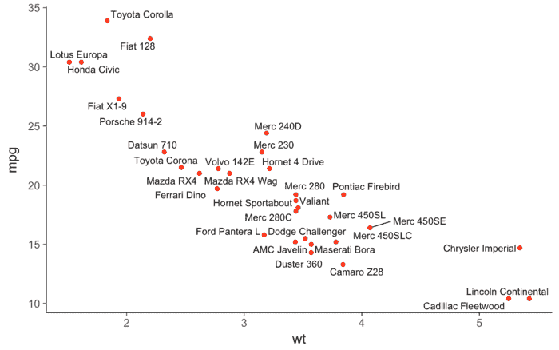
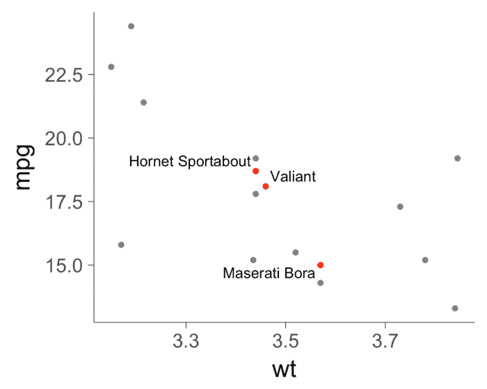
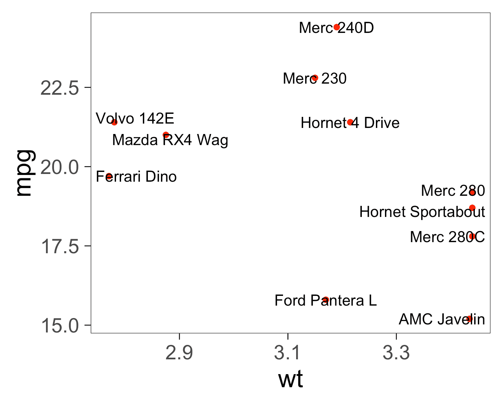
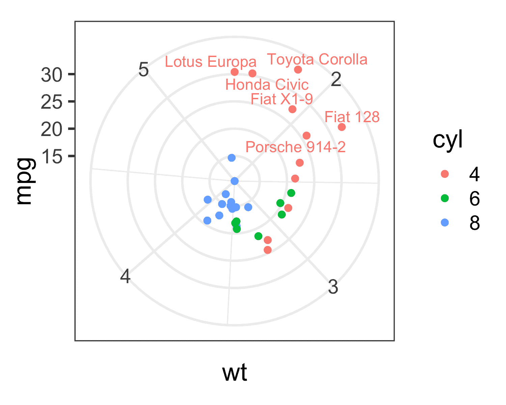

ggrepel 
============================================

[![GitHub Version][gb]][releases] [![Build Status][bb]][travis] [![CRAN_Status_Badge][cb]][cran] [![CRAN_Downloads_Badge][db]][r-pkg]

[cb]: http://www.r-pkg.org/badges/version/ggrepel?color=blue
[cran]: https://CRAN.R-project.org/package=ggrepel

[db]: http://cranlogs.r-pkg.org/badges/grand-total/ggrepel?color=blue
[r-pkg]: https://www.r-pkg.org/pkg/ggrepel

[gb]: https://badge.fury.io/gh/slowkow%2Fggrepel.svg?text=Github
[releases]: https://github.com/slowkow/ggrepel/releases

[bb]: https://travis-ci.org/slowkow/ggrepel.svg?branch=master
[travis]: https://travis-ci.org/slowkow/ggrepel

Overview
--------

ggrepel provides geoms for [ggplot2] to repel overlapping text labels:

- `geom_text_repel()`
- `geom_label_repel()`

Text labels repel away from each other, away from data points, and away
from edges of the plotting area.

```r
library(ggrepel)
ggplot(mtcars, aes(wt, mpg, label = rownames(mtcars))) +
  geom_text_repel() +
  geom_point(color = 'red') +
  theme_classic(base_size = 16)
```



Installation
------------

```r
# The easiest way to get ggrepel is to install it from CRAN:
install.packages("ggrepel")

# Or get the the development version from GitHub:
# install.packages("devtools")
devtools::install_github("slowkow/ggrepel")

# Or use the install-github.me service
source("https://install-github.me/slowkow/ggrepel")
```

Usage
-----

See the [vignette] for the code behind these examples:

<a href="vignettes/ggrepel.md#hide-some-of-the-labels"></a> <a href="vignettes/ggrepel.md#do-not-repel-labels-from-data-points"></a> <a href="vignettes/ggrepel.md#align-text-labels"></a> <a href="vignettes/ggrepel.md#limit-labels-to-a-specific-area"></a> <a href="vignettes/ggrepel.md#polar-coordinates"></a> <a href="vignettes/ggrepel.md#mathematical-expressions"></a>

Contributing
------------

Please [submit an issue][issues] to report bugs or ask questions.

Please contribute bug fixes or new features with a [pull request][pull] to this
repository.

[issues]: https://github.com/slowkow/ggrepel/issues
[pull]: https://help.github.com/articles/using-pull-requests/

Related work
------------

### Academic Papers

[An Efficient Algorithm for Scatter Chart Labeling][aaai]

Sebastian Theophil, Arno Schödl

> This paper presents an efficient algorithm for a new variation of the point
> feature labeling problem. The goal is to position the largest number of point
> labels such that they do not intersect each other or their points. First we
> present an algorithm using a greedy algorithm with limited lookahead. We then
> present an algorithm that iteratively regroups labels, calling the first
> algorithm on each group, thereby identifying a close to optimal labeling
> order. The presented algorithm is being used in a commercial product to label
> charts, and our evaluation shows that it produces results far superior to
> those of other labeling algorithms.

This might be a good start for a revision of ggrepel.

[aaai]: http://www.aaai.org/Papers/AAAI/2006/AAAI06-167.pdf

### Python

[adjustText]

> A small library for automatically adjusting text position in matplotlib plots to minimize overlaps.

Ilya Flyamer's Python library that extends [matplotlib].

[adjustText]: https://github.com/Phlya/adjustText
[matplotlib]: https://matplotlib.org/

### R

[directlabels]

> An extensible framework for automatically placing direct labels onto
> multicolor 'lattice' or 'ggplot2' plots. Label positions are described
> using Positioning Methods which can be re-used across several different
> plots. There are heuristics for examining "trellis" and "ggplot" objects
> and inferring an appropriate Positioning Method.

[wordcloud]

> Pretty word clouds.

The `wordcloud` package implements a spiraling algorithm to prevent text
labels from overlapping each other.

[FField]

> Force field simulation of interaction of set of points. Very useful for
> placing text labels on graphs, such as scatterplots.

I found that functions in the `FField` package were not ideal for repelling
overlapping rectangles, so I wrote my own.

See [this gist][1] for examples of how to use the `wordcloud` and `FField`
packages with `ggplot2`.

[1]: https://gist.github.com/slowkow/003b4d9f3f59cee8551c

[ggplot2]: http://ggplot2.tidyverse.org
[vignette]: https://github.com/slowkow/ggrepel/blob/master/vignettes/ggrepel.md
[directlabels]: https://cran.r-project.org/package=directlabels
[wordcloud]: https://cran.r-project.org/package=wordcloud
[FField]: https://cran.r-project.org/package=FField
