# Examples

## Overview

ggrepel provides geoms for [ggplot2](https://ggplot2.tidyverse.org/) to
repel overlapping text labels:

- [`geom_text_repel()`](https://ggrepel.slowkow.com/reference/geom_text_repel.md)
- [`geom_label_repel()`](https://ggrepel.slowkow.com/reference/geom_text_repel.md)
- [`geom_marquee_repel()`](https://ggrepel.slowkow.com/reference/geom_text_repel.md)

Text labels repel away from each other, away from data points, and away
from edges of the plotting area (panel).

Let’s compare
[`geom_text()`](https://ggplot2.tidyverse.org/reference/geom_text.html)
and
[`geom_text_repel()`](https://ggrepel.slowkow.com/reference/geom_text_repel.md):

``` r
library(ggrepel)
set.seed(42)

dat <- subset(mtcars, wt > 2.75 & wt < 3.45)
dat$car <- rownames(dat)

p <- ggplot(dat, aes(wt, mpg, label = car)) +
  geom_point(color = "red")

p1 <- p + geom_text() + labs(title = "geom_text()")

p2 <- p + geom_text_repel() + labs(title = "geom_text_repel()")

gridExtra::grid.arrange(p1, p2, ncol = 2)
```

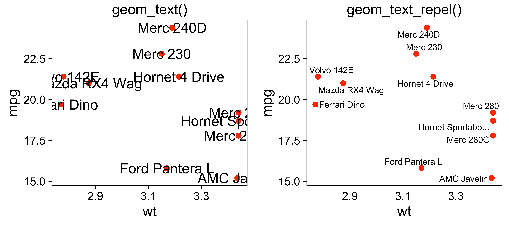

## Installation

ggrepel is available on
[CRAN](https://CRAN.R-project.org/package=ggrepel):

``` r
install.packages("ggrepel")
```

The [latest development version](https://github.com/slowkow/ggrepel) may
have new features, and you can get it from GitHub:

``` r
# Use the devtools package
# install.packages("devtools")
devtools::install_github("slowkow/ggrepel")
```

## Options

Options allow us to change the behavior of ggrepel to fit the needs of
our figure. Most of them are global options that affect all of the text
labels, but some can be vectors of the same length as your data, like
`nudge_x` or `nudge_y`.

| Option | Default | Description |
|----|----|----|
| `seed` | `NA` | random seed for recreating the exact same layout |
| `force` | `1` | force of repulsion between overlapping text labels |
| `force_pull` | `1` | force of attraction between each text label and its data point |
| `direction` | `"both"` | move text labels “both” (default), “x”, or “y” directions |
| `max.time` | `0.5` | maximum number of seconds to try to resolve overlaps |
| `max.iter` | `10000` | maximum number of iterations to try to resolve overlaps |
| `max.overlaps` | `10` | discard text labels that overlap too many other text labels or data points |
| `nudge_x` | `0` | adjust the starting x position of the text label |
| `nudge_y` | `0` | adjust the starting y position of the text label |
| `box.padding` | `0.25 lines` | padding around the text label |
| `point.padding` | `0 lines` | padding around the labeled data point |
| `arrow` | `NULL` | render line segment as an arrow with [`grid::arrow()`](https://rdrr.io/r/grid/arrow.html) |
| `min.segment.length` | `0.5` | only draw line segments that are longer than 0.5 (default) |

## Aesthetics

Aesthetics are parameters that can be mapped to your data with
`geom_text_repel(mapping = aes(...))`.

ggrepel provides the same aesthetics for `geom_text_repel` and
`geom_label_repel` that are available in
[geom_text()](https://ggplot2.tidyverse.org/reference/geom_text.html) or
[geom_label()](https://ggplot2.tidyverse.org/reference/geom_text.html),
but it also provides a few more that are unique to ggrepel.

All of them are listed below. See the [ggplot2 documentation about
aesthetic
specifications](https://ggplot2.tidyverse.org/articles/ggplot2-specs.html)
for more details and examples.

The following aesthetics are the same for all functions
([`geom_text()`](https://ggplot2.tidyverse.org/reference/geom_text.html),
[`geom_text_repel()`](https://ggrepel.slowkow.com/reference/geom_text_repel.md),
etc.):

| Aesthetic    | Default   | Description                              |
|--------------|-----------|------------------------------------------|
| `color`      | `"black"` | text and label border color              |
| `size`       | `3.88`    | font size                                |
| `angle`      | `0`       | angle of the text label                  |
| `alpha`      | `NA`      | transparency of the text label           |
| `family`     | `""`      | font name                                |
| `fontface`   | `1`       | “plain”, “bold”, “italic”, “bold.italic” |
| `lineheight` | `1.2`     | line height for text labels              |
| `hjust`      | `0.5`     | horizontal justification                 |
| `vjust`      | `0.5`     | vertical justification                   |

These aesthetics are specific to ggrepel functions, but not applicable
to ggplot2 functions:

| Aesthetic | Default | Description |
|----|----|----|
| `point.size` | `1` | size of each point for each text label |
| `segment.linetype` | `1` | line segment solid, dashed, etc. |
| `segment.color` | `"black"` | line segment color |
| `segment.size` | `0.5 mm` | line segment thickness |
| `segment.alpha` | `1.0` | line segment transparency |
| `segment.curvature` | `0` | numeric, negative for left-hand and positive for right-hand curves, 0 for straight lines |
| `segment.angle` | `90` | 0-180, less than 90 skews control points toward the start point |
| `segment.ncp` | `1` | number of control points to make a smoother curve |
| `segment.shape` | `0.5` | curve shape by control points approximation/interpolation (1 for cubic B-spline, -1 for Catmull-Rom spline) |
| `segment.square` | `TRUE` | `TRUE` to place control points in city-block fashion, `FALSE` for oblique placement |
| `segment.squareShape` | `1` | shape of the curve relative to additional control points inserted if square is `TRUE` |
| `segment.inflect` | `FALSE` | curve inflection at the midpoint |
| `segment.debug` | `FALSE` | display the curve debug information |

And the following aesthetics are specific to
[`geom_marquee_repel()`](https://ggrepel.slowkow.com/reference/geom_text_repel.md):

| Aesthetic | Default | Description |
|----|----|----|
| `style` | `NULL` | a `marquee_style` object specifying the styling, see [`marquee::style()`](https://marquee.r-lib.org/reference/style.html) |
| `width` | `NA` | a [`grid::unit()`](https://rdrr.io/r/grid/unit.html) object specifying the width of each marquee element, e.g., `unit(2, "cm")` |

## Advanced examples

The ggrepel package works well with the
[ggpp](https://docs.r4photobiology.info/ggpp/) package!

For more advanced ggrepel examples, check out the [ggpp
examples](https://docs.r4photobiology.info/ggpp/articles/nudge-examples.html)
by Pedro Aphalo. In that article, Pedro shows how to use nudging
functions from the [ggpp](https://docs.r4photobiology.info/ggpp/)
package to achieve greater control over label positions.

The [ggpp
examples](https://docs.r4photobiology.info/ggpp/articles/nudge-examples.html)
page describes how to use many advanced functions, including:

- [`position_nudge_to()`](https://docs.r4photobiology.info/ggpp/reference/position_nudge_to.html)
- [`position_nudge_center()`](https://docs.r4photobiology.info/ggpp/reference/position_nudge_center.html)
- [`position_nudge_line()`](https://docs.r4photobiology.info/ggpp/reference/position_nudge_line.html)
- [`position_nudge_keep()`](https://docs.r4photobiology.info/ggpp/reference/position_nudge_keep.html)
- and many more!

## Examples

### Hide some of the labels

Set labels to the empty string `""` to hide them. All data points repel
the non-empty labels.

``` r
set.seed(42)

dat2 <- subset(mtcars, wt > 3 & wt < 4)
# Hide all of the text labels.
dat2$car <- ""
# Let's just label these items.
ix_label <- c(2, 3, 14)
dat2$car[ix_label] <- rownames(dat2)[ix_label]

ggplot(dat2, aes(wt, mpg, label = car)) +
  geom_text_repel() +
  geom_point(color = ifelse(dat2$car == "", "grey50", "red"))
```

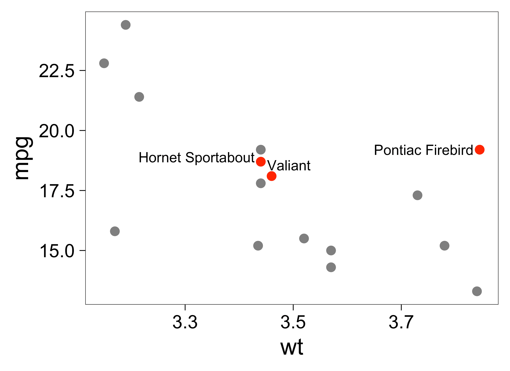

We can quickly repel a few text labels from 10,000 data points in the
example below.

We use `max.overlaps = Inf` to ensure that no text labels are discarded,
even if a text label overlaps lots of other things (e.g. other text
labels or other data points).

``` r
set.seed(42)

dat3 <- rbind(
  data.frame(
    wt  = rnorm(n = 10000, mean = 3),
    mpg = rnorm(n = 10000, mean = 19),
    car = ""
  ),
  dat2[,c("wt", "mpg", "car")]
)

ggplot(dat3, aes(wt, mpg, label = car)) +
  geom_point(data = dat3[dat3$car == "",], color = "grey50") +
  geom_text_repel(box.padding = 0.5, max.overlaps = Inf) +
  geom_point(data = dat3[dat3$car != "",], color = "red")
```

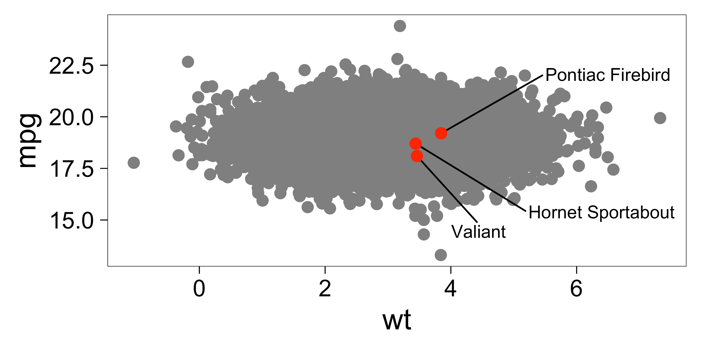

### Always show all labels, even when they have too many overlaps

Some text labels will be discarded if they overlap too many other things
(default limit is 10). So, if a text label overlaps 10 other text labels
or data points, then it will be discarded.

We can expect to see a warning if some data points could not be labeled
due to too many overlaps.

Set `max.overlaps = Inf` to override this behavior and always show all
labels, regardless of whether or not a text label overlaps too many
other things.

Use `options(ggrepel.max.overlaps = Inf)` to set this globally for your
entire session. The global option can be overridden by providing the
`max.overlaps` argument to
[`geom_text_repel()`](https://ggrepel.slowkow.com/reference/geom_text_repel.md).

``` r
set.seed(42)

n <- 15
dat4 <- data.frame(
  x = rep(1, length.out = n),
  y = rep(1, length.out = n),
  label = letters[1:n]
)

# Set it globally:
options(ggrepel.max.overlaps = Inf)

p1 <- ggplot(dat4, aes(x, y, label = label)) +
  geom_point() +
  geom_label_repel(box.padding = 0.5, max.overlaps = 10) +
  labs(title = "max.overlaps = 10 (default)")

p2 <- ggplot(dat4, aes(x, y, label = label)) +
  geom_point() +
  geom_label_repel(box.padding = 0.5) +
  labs(title = "max.overlaps = Inf")

gridExtra::grid.arrange(p1, p2, ncol = 2)
```

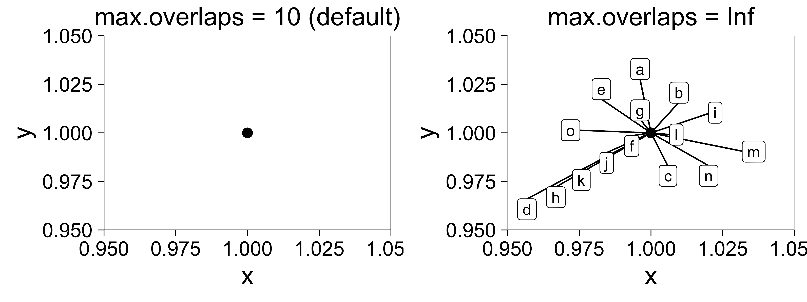

### Do not repel labels from data points

Set `point.size = NA` to prevent label repulsion away from data points.

Labels will still move away from each other and away from the edges of
the plot.

``` r
set.seed(42)
ggplot(dat, aes(wt, mpg, label = car)) +
  geom_point(color = "red") +
  geom_text_repel(point.size = NA)
```

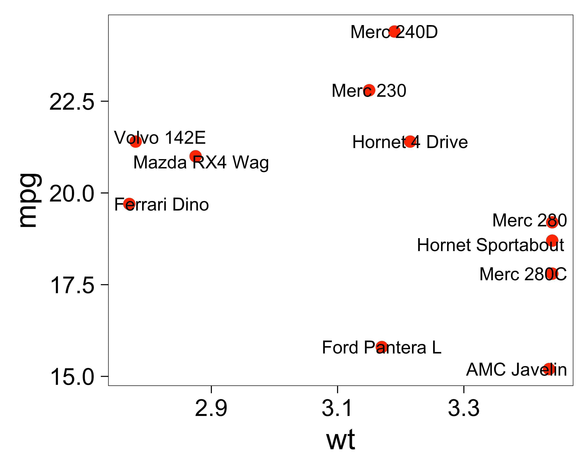

### Do not repel labels from plot (panel) edges

Set `xlim` or `ylim` to `Inf` or `-Inf` to disable repulsion away from
the edges of the panel. Use `NA` to indicate the edge of the panel.

``` r
set.seed(42)
ggplot(dat, aes(wt, mpg, label = car)) +
  geom_point(color = "red") +
  geom_text_repel(
    # Repel away from the left edge, not from the right.
    xlim = c(NA, Inf),
    # Do not repel from top or bottom edges.
    ylim = c(-Inf, Inf)
  )
```

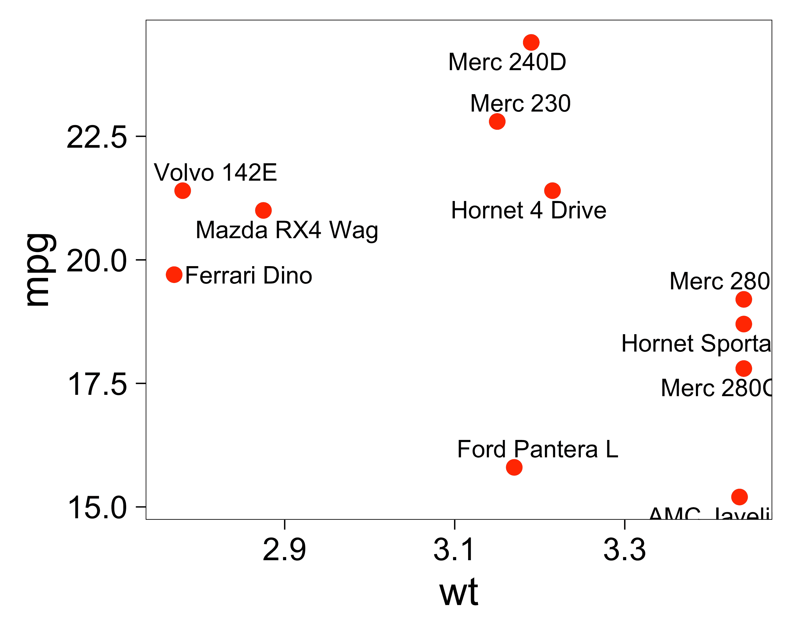

We can also disable clipping to allow the labels to go beyond the edges
of the panel.

``` r
set.seed(42)
ggplot(dat, aes(wt, mpg, label = car)) +
  geom_point(color = "red") +
  coord_cartesian(clip = "off") +
  geom_label_repel(fill = "white", xlim = c(-Inf, Inf), ylim = c(-Inf, Inf))
```

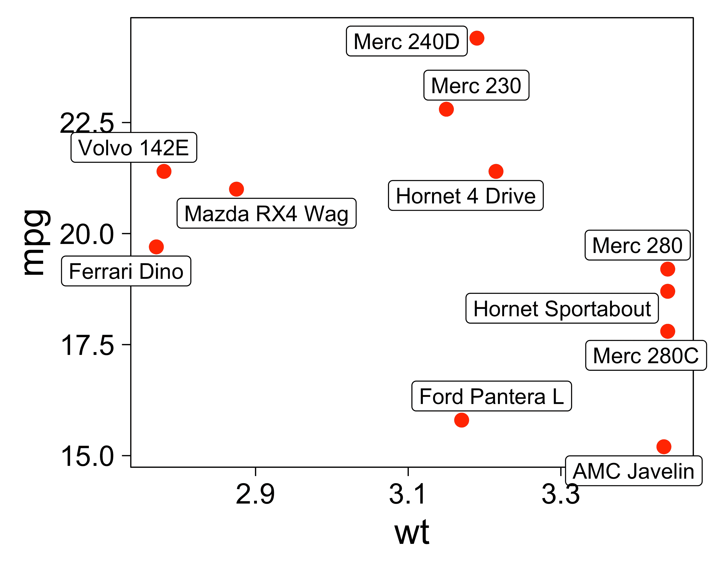

### Expand the scale to make room for labels

Since the text labels repel away from the edges of the plot panel, we
might want to expand the scale to give them more room to fit.

``` r
set.seed(42)
d <- data.frame(
  x1 = 1,
  y1 = rnorm(10),
  x2 = 2,
  y2 = rnorm(10),
  lab = state.name[1:10]
)

p <- ggplot(d, aes(x1, y1, xend = x2, yend = y2, label = lab, col = lab)) +
  geom_segment(size = 1) +
  guides(color = "none") +
  theme(axis.title.x = element_blank()) +
  geom_text_repel(
    nudge_x = -0.2, direction = "y", hjust = "right"
  ) +
  geom_text_repel(
    aes(x2, y2), nudge_x = 0.1, direction = "y", hjust = "left"
  )

p
```

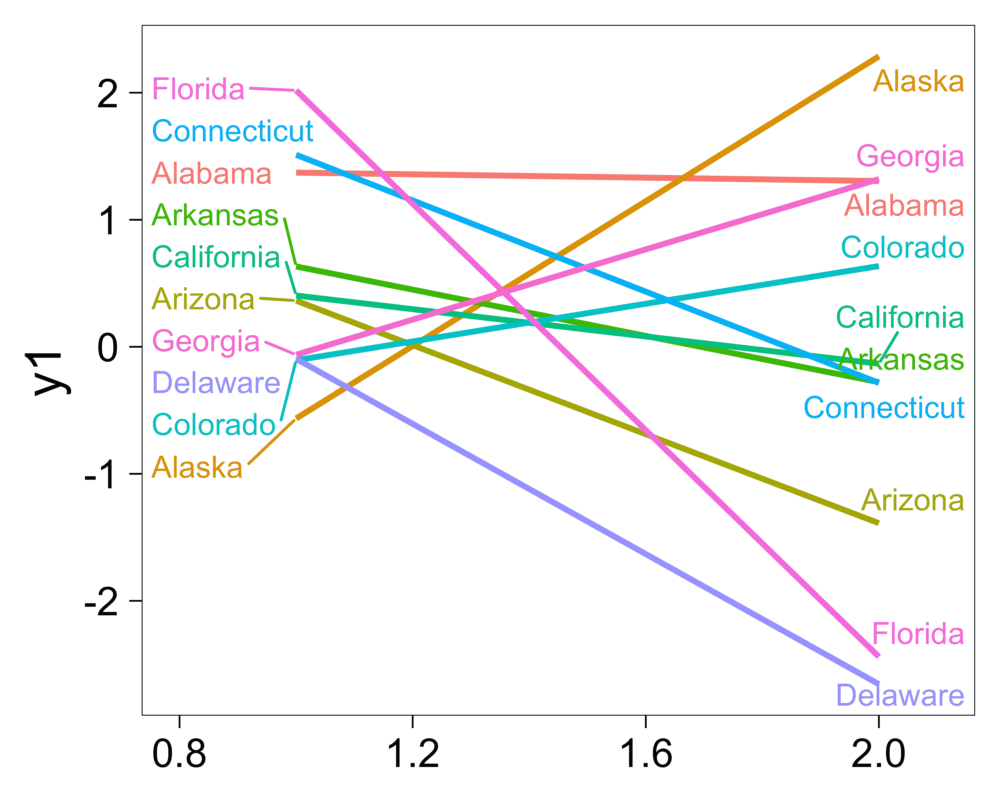

``` r
p + scale_x_continuous(
  breaks = 1:2, labels = c("Dimension 1", "Dimension 2"),
  expand = expansion(mult = 0.5)
)
```

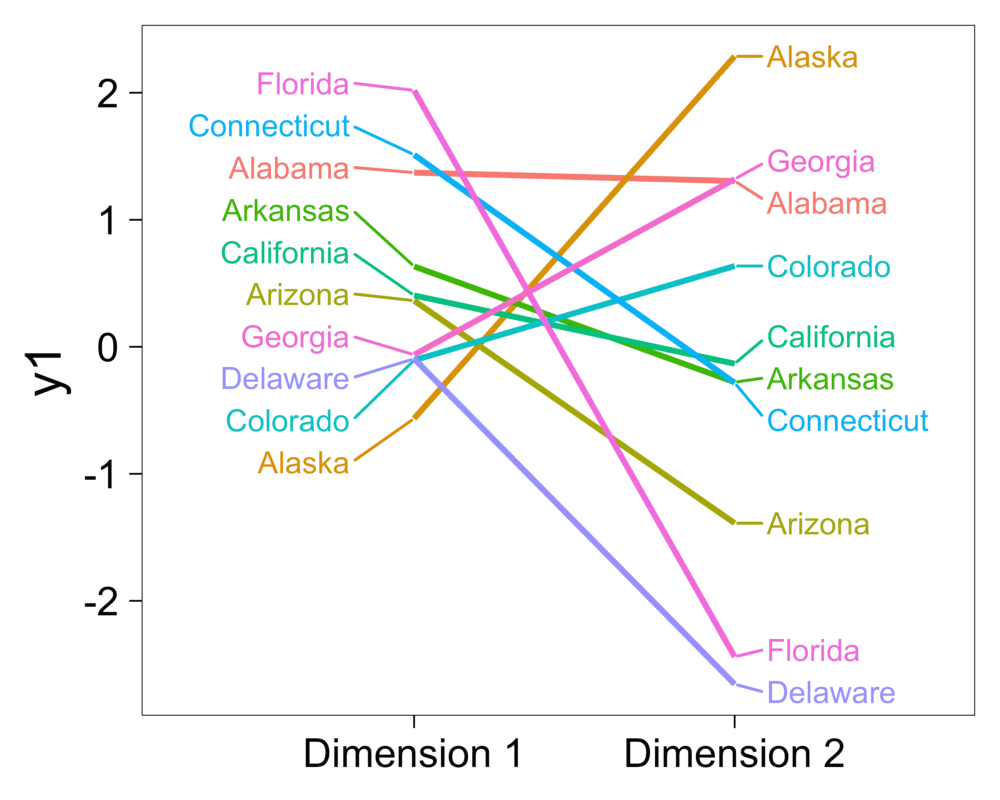

### Always (or never) draw line segments

Use `min.segment.length = 0` to draw all line segments, no matter how
short they are.

Use `min.segment.length = Inf` to never draw any line segments, no
matter how long they are.

``` r
p <- ggplot(dat, aes(wt, mpg, label = car)) +
  geom_point(color = "red")

p1 <- p +
  geom_text_repel(min.segment.length = 0, seed = 42, box.padding = 0.5) +
  labs(title = "min.segment.length = 0")

p2 <- p +
  geom_text_repel(min.segment.length = Inf, seed = 42, box.padding = 0.5) +
  labs(title = "min.segment.length = Inf")

gridExtra::grid.arrange(p1, p2, ncol = 2)
```

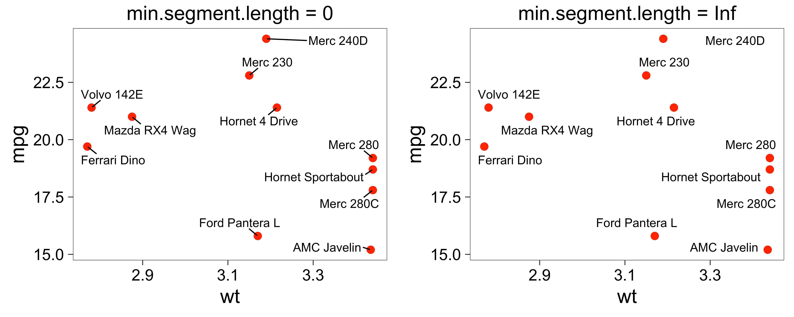

### Make curved line segments or arrows

The line segments can be curved as in
[`geom_curve()`](https://ggplot2.tidyverse.org/reference/geom_segment.html)
from ggplot2.

- `segment.curvature = 1` increases right-hand curvature, negative
  values would increase left-hand curvature, 0 makes straight lines
- `segment.ncp = 3` gives 3 control points for the curve
- `segment.angle = 20` skews the curve towards the start, values greater
  than 90 would skew toward the end

``` r
set.seed(42)
ggplot(dat, aes(wt, mpg, label = car)) +
  geom_point(color = "red") +
  geom_text_repel(
    nudge_x = .15,
    box.padding = 0.5,
    nudge_y = 1,
    segment.curvature = -0.1,
    segment.ncp = 3,
    segment.angle = 20
  )
```

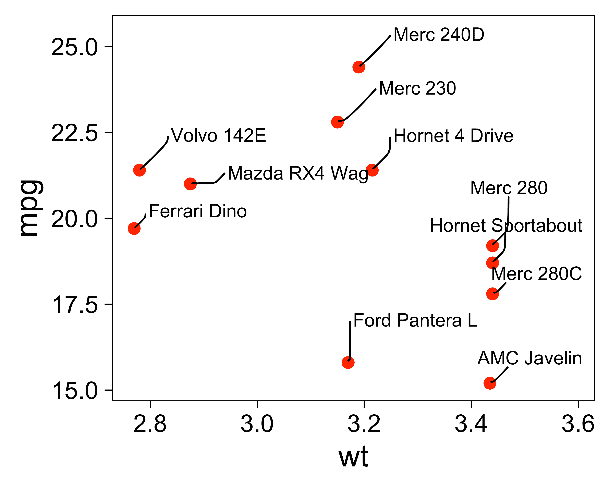

Setting the curvature to a value near zero gives a sharp angle:

``` r
set.seed(42)
cars <- c("Volvo 142E", "Merc 230")

ggplot(dat) +
  aes(wt, mpg, label = ifelse(car %in% cars, car, "")) +
  geom_point(color = "red") +
  geom_text_repel(
    point.padding = 0.2, 
    nudge_x = .15,
    nudge_y = .5,
    segment.curvature = -1e-20,
    arrow = arrow(length = unit(0.015, "npc"))
  ) +
  theme(legend.position = "none")
```

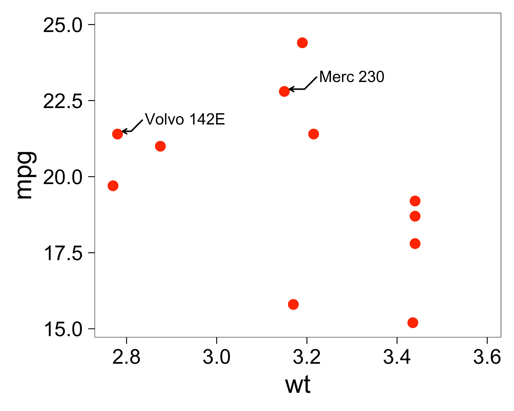

Set `segment.square`to `FALSE` to get oblique curves, and
`segment.inflect` to `TRUE` to introduce an inflection point.

``` r
set.seed(42)

cars_subset <- head(mtcars, 5)
cars_subset$car <- rownames(cars_subset)

cars_subset_curves <- cars_subset[rep(seq_len(nrow(cars_subset)), times = 4), ]
cars_subset_curves$square <- rep(c(TRUE, FALSE), each = nrow(cars_subset) * 2)
cars_subset_curves$inflect <- rep(c(TRUE, FALSE, TRUE, FALSE), each = nrow(cars_subset))

ggplot(cars_subset_curves, aes(y = wt, x = 1, label = car)) +
  facet_grid(square ~ inflect, labeller = labeller(.default = label_both)) +
  geom_point(color = "red") +
  ylim(1, 4.5) +
  xlim(1, 1.375) +
  geom_text_repel(
    aes(
      segment.square  = square,
      segment.inflect = inflect,
    ),
    force             = 0.5,
    nudge_x           = 0.15,
    direction         = "y",
    hjust             = 0,
    segment.size      = 0.2,
    segment.curvature = -0.1
  ) +
  theme(
    axis.line.x  = element_blank(),
    axis.ticks.x = element_blank(),
    axis.text.x  = element_blank(),
    axis.title.x = element_blank()
  )
```

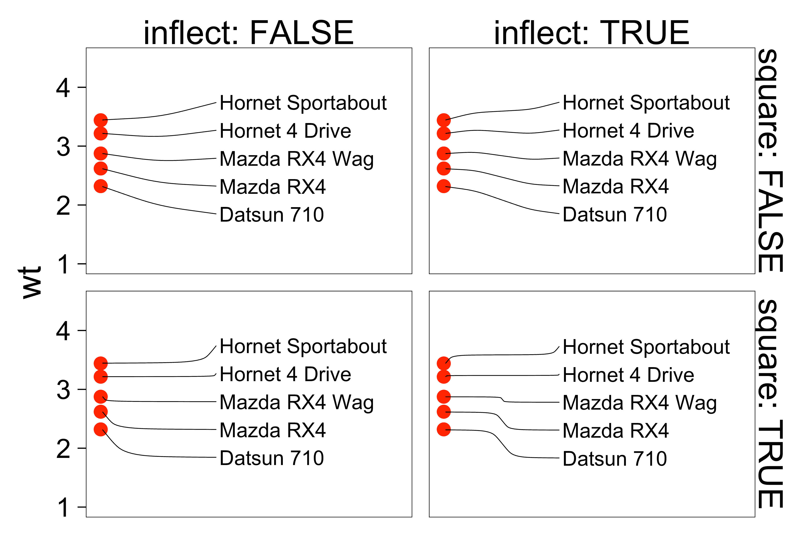

Use `segment.shape` to adjust the interpolation of the control points:

``` r
set.seed(42)

cars_subset_shapes <- cars_subset[rep(seq_len(nrow(cars_subset)), times = 5), ]
cars_subset_shapes$shape <- rep(c(-1, -0.5, 0, 0.5, 1), each = nrow(cars_subset))

ggplot(cars_subset_shapes, aes(y = wt, x = 1, label = car)) +
  facet_wrap('shape', labeller = labeller(.default = label_both), ncol = 1) +
  geom_point(color = "red") +
  ylim(1, 4.5) +
  xlim(1, 1.375) +
  geom_text_repel(
    aes(
      segment.shape   = shape
    ),
    force             = 0.5,
    nudge_x           = 0.25,
    direction         = "y",
    hjust             = 0,
    segment.size      = 0.2,
    segment.curvature = -0.6,
    segment.angle     = 45,
    segment.ncp       = 2,
    segment.square    = FALSE,
    segment.inflect   = TRUE
  ) +
  theme(
    axis.line.x  = element_blank(),
    axis.ticks.x = element_blank(),
    axis.text.x  = element_blank(),
    axis.title.x = element_blank()
  )
```

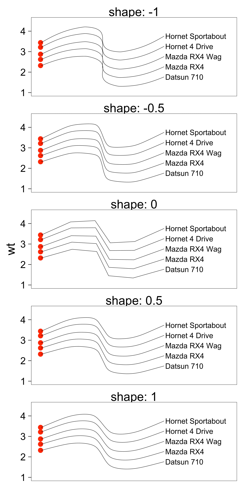

We can use different line types (1, 2, 3, 4, 5, or 6).

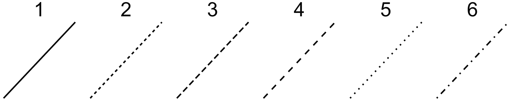

And different types of arrows. See
[ggplot2::geom_segment()](https://ggplot2.tidyverse.org/reference/geom_segment.html)
for more details.

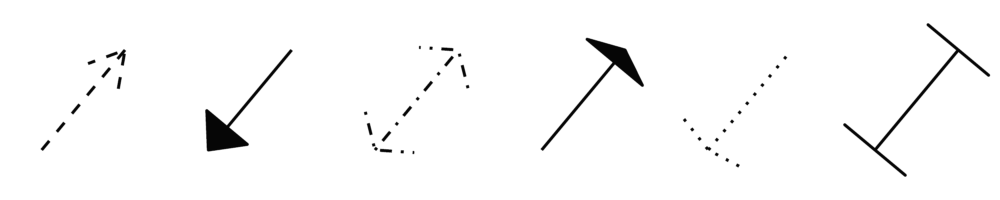

``` r
set.seed(42)
cars <- c("Volvo 142E", "Merc 230")

ggplot(dat, aes(wt, mpg, label = ifelse(car %in% cars, car, ""))) +
  geom_point(color = "red") +
  geom_text_repel(
    point.padding = 0.2, 
    nudge_x = .15,
    nudge_y = .5,
    segment.linetype = 6,
    segment.curvature = -1e-20,
    arrow = arrow(length = unit(0.015, "npc"))
  )
```

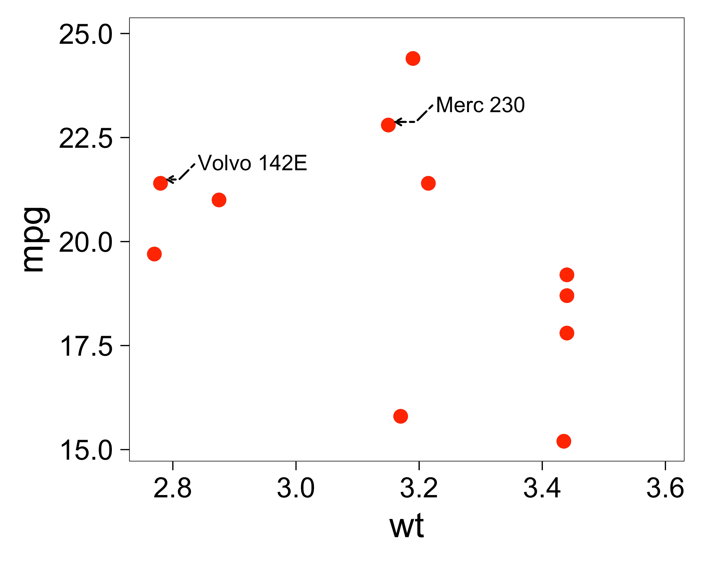

### Closed arrows with custom fill color

Use the `arrow.fill` aesthetic to set the fill color for closed arrow
heads independently from `segment.colour`. By default, `arrow.fill`
matches the segment color.

``` r
df <- mtcars[1:8,]
df$car <- rownames(df)

p1 <- ggplot(df, aes(wt, mpg, label = car)) +
  geom_point(color = "red") +
  geom_text_repel(
    min.segment.length = 0,
    segment.linetype = 1,
    arrow = arrow(length = unit(0.05, "npc"), type = "closed"),
    box.padding = 1.5
  ) +
  labs(title = "default: arrow.fill matches segment")

p2 <- ggplot(df, aes(wt, mpg, label = car)) +
  geom_point(color = "red") +
  geom_text_repel(
    min.segment.length = 0,
    segment.colour = "blue",
    segment.linetype = 1,
    arrow = arrow(length = unit(0.05, "npc"), type = "closed"),
    box.padding = 1.5,
    arrow.fill = "green"
  ) +
  labs(title = "arrow.fill = 'yellow'")

gridExtra::grid.arrange(p1, p2, ncol = 2)
```

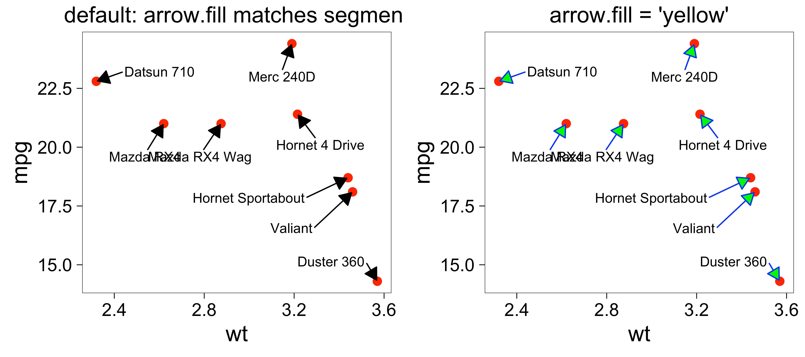

### Customize label border with linetype and linewidth

Use `linetype` and `linewidth` to customize the border of
[`geom_label_repel()`](https://ggrepel.slowkow.com/reference/geom_text_repel.md).
Set `linewidth = 0` to hide the border entirely.

``` r
df <- mtcars[1:8,]
df$car <- rownames(df)

p1 <- ggplot(df, aes(wt, mpg, label = car)) +
  geom_point(color = "red") +
  geom_label_repel(
    fill = "white",
    linewidth = 2,
    linetype = "dashed"
  ) +
  labs(title = "linewidth = 2, linetype = 'dashed'")

p2 <- ggplot(df, aes(wt, mpg, label = car)) +
  geom_point(color = "red") +
  geom_label_repel(
    fill = "lightblue",
    linewidth = 0
  ) +
  labs(title = "linewidth = 0 (no border)")

gridExtra::grid.arrange(p1, p2, ncol = 2)
```

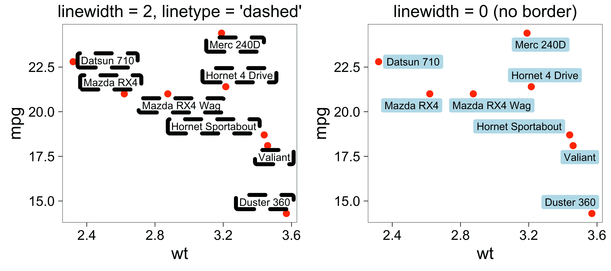

### Adjust line spacing with lineheight

Use `lineheight` to control the spacing between lines in multi-line
labels.

``` r
df <- data.frame(
  x = c(1, 2, 3),
  y = c(1, 2, 3),
  label = c("Compact\nline\nspacing", "Default\nline\nspacing", "Spacious\nline\nspacing")
)

p1 <- ggplot(df, aes(x, y, label = label)) +
  geom_point(color = "red", size = 3) +
  geom_label_repel(lineheight = 0.8, fill = "lightblue") +
  labs(title = "lineheight = 0.8")

p2 <- ggplot(df, aes(x, y, label = label)) +
  geom_point(color = "red", size = 3) +
  geom_label_repel(lineheight = 1.2, fill = "lightgreen") +
  labs(title = "lineheight = 1.2 (default)")

p3 <- ggplot(df, aes(x, y, label = label)) +
  geom_point(color = "red", size = 3) +
  geom_label_repel(lineheight = 2.0, fill = "lightyellow") +
  labs(title = "lineheight = 2.0")

gridExtra::grid.arrange(p1, p2, p3, ncol = 3)
```

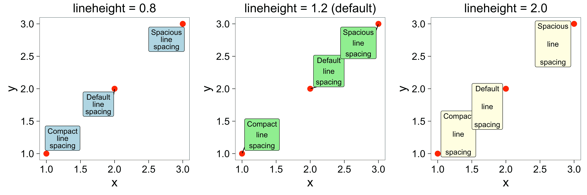

### Repel labels from data points with different sizes

We can use the
[continuous_scale()](https://ggplot2.tidyverse.org/reference/continuous_scale.html)
function from ggplot2. It allows us to specify a single scale that
applies to multiple aesthetics.

For ggrepel, we want to apply a single size scale to two aesthetics:

- `size`, which tells ggplot2 the size of the points to draw on the plot
- `point.size`, which tells ggrepel the point size, so it can position
  the text labels away from them

In the example below, there is a third `size` in the call to
[`geom_text_repel()`](https://ggrepel.slowkow.com/reference/geom_text_repel.md)
to specify the font size for the text labels.

- geom_text_repel()
- geom_label_repel()

``` r
my_pal <- function(range = c(1, 6)) {
  force(range)
  function(x) scales::rescale(x, to = range, from = c(0, 1))
}

ggplot(dat, aes(wt, mpg, label = car)) +
  geom_point(aes(size = cyl), alpha = 0.6) + # data point size
  continuous_scale(
    aesthetics = c("size", "point.size"), scale_name = "size",
    palette = my_pal(c(2, 15)),
    guide = guide_legend(override.aes = list(label = "")) # hide "a" in legend
  ) +
  geom_text_repel(
    aes(point.size = cyl), # data point size
    size = 5, # font size in the text labels
    point.padding = 0, # additional padding around each point
    min.segment.length = 0, # draw all line segments
    max.time = 1, max.iter = 1e5, # stop after 1 second, or after 100,000 iterations
    box.padding = 0.3 # additional padding around each text label
  ) +
  theme(legend.position = "right")
```

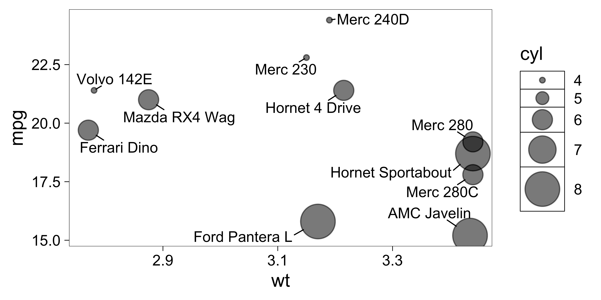

``` r
my_pal <- function(range = c(1, 6)) {
  force(range)
  function(x) scales::rescale(x, to = range, from = c(0, 1))
}

ggplot(dat, aes(wt, mpg, label = car)) +
  geom_label_repel(
    aes(point.size = cyl), # data point size
    size = 5, # font size in the text labels
    point.padding = 0, # additional padding around each point
    min.segment.length = 0, # draw all line segments
    max.time = 1, max.iter = 1e5, # stop after 1 second, or after 100,000 iterations
    box.padding = 0.3 # additional padding around each text label
  ) +
  # Put geom_point() after geom_label_repel, so the
  # legend for geom_point() appears on the top layer.
  geom_point(aes(size = cyl), alpha = 0.6) + # data point size
  continuous_scale(
    aesthetics = c("size", "point.size"),
    scale_name = "size",
    palette = my_pal(c(2, 15)),
    guide = guide_legend(override.aes = list(label = "")) # hide "a" in legend
  ) +
  theme(legend.position = "right")
```

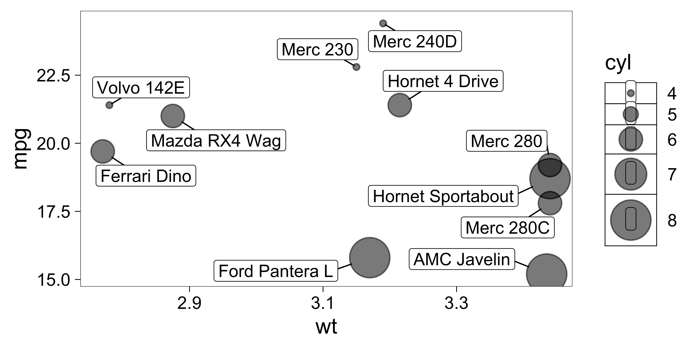

### Limit labels to a specific area

Use options `xlim` and `ylim` to constrain the labels to a specific
area. Limits are specified in data coordinates. Use `NA` when there is
no lower or upper bound in a particular direction.

Here we also use [`grid::arrow()`](https://rdrr.io/r/grid/arrow.html) to
render the segments as arrows.

``` r
set.seed(42)

# All labels should be to the right of 3.
x_limits <- c(3, NA)

p <- ggplot(dat) +
  aes(
    x = wt, y = mpg, label = car,
    fill = factor(cyl), segment.color = factor(cyl)
  ) +
  geom_vline(xintercept = x_limits, linetype = 3) +
  geom_point() +
  geom_label_repel(
    color = "white",
    arrow = arrow(
      length = unit(0.03, "npc"), type = "closed", ends = "first"
    ),
    xlim  = x_limits,
    point.padding = NA,
    box.padding = 0.1
  ) +
  scale_fill_discrete(
    name = "cyl",
    # The same color scall will apply to both of these aesthetics.
    aesthetics = c("fill", "segment.color")
  )

p
```

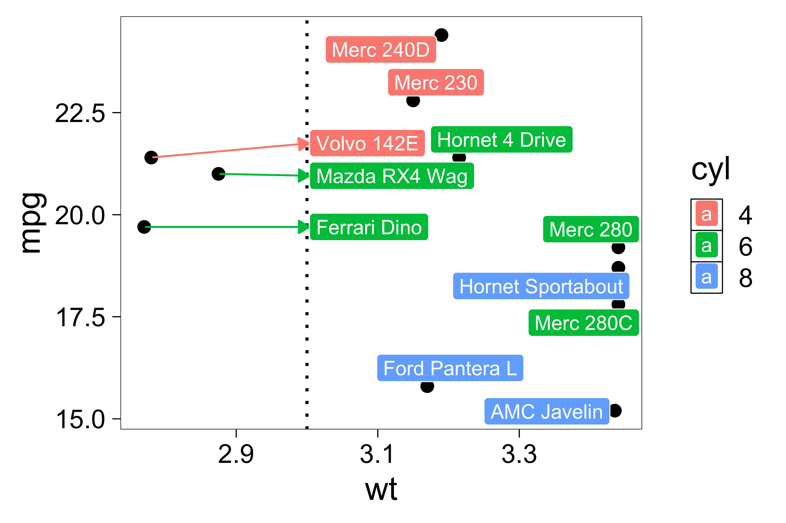

### Remove “a” from the legend

Sometimes we want to remove the “a” labels in the legend.

We can do that by overriding the legend aesthetics:

``` r
# Don't use "color" in the legend.
p + guides(fill = guide_legend(override.aes = aes(color = NA)))
```

``` r
# Or set the label to the empty string "" (or any other string).
p + guides(fill = guide_legend(override.aes = aes(label = "")))
```

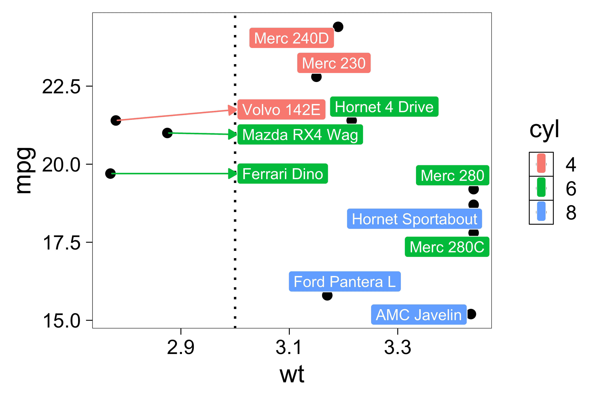

### Align labels on the top or bottom edge

Use `hjust` to justify the text neatly:

- `hjust = 0` for left-align
- `hjust = 0.5` for center
- `hjust = 1` for right-align

Sometimes the labels do not align perfectly. Try using `direction = "x"`
to limit label movement to the x-axis (left and right) or
`direction = "y"` to limit movement to the y-axis (up and down). The
default is `direction = "both"`.

Also try using
[xlim()](https://ggplot2.tidyverse.org/reference/lims.html) and
[ylim()](https://ggplot2.tidyverse.org/reference/lims.html) to increase
the size of the plotting area so all of the labels fit comfortably.

``` r
set.seed(42)

ggplot(mtcars, aes(x = wt, y = 1, label = rownames(mtcars))) +
  geom_point(color = "red") +
  geom_text_repel(
    force_pull   = 0, # do not pull toward data points
    nudge_y      = 0.05,
    direction    = "x",
    angle        = 90,
    hjust        = 0,
    segment.size = 0.2,
    max.iter = 1e4, max.time = 1
  ) +
  xlim(1, 6) +
  ylim(1, 0.8) +
  theme(
    axis.line.y  = element_blank(),
    axis.ticks.y = element_blank(),
    axis.text.y  = element_blank(),
    axis.title.y = element_blank()
  )
```

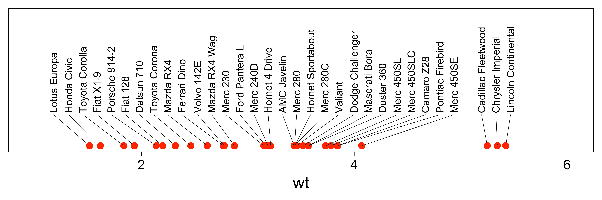

Align text vertically with `nudge_y` and allow the labels to move
horizontally with `direction = "x"`:

``` r
set.seed(42)

dat <- mtcars
dat$car <- rownames(dat)

ggplot(dat, aes(qsec, mpg, label = car)) +
  geom_text_repel(
    data          = subset(dat, mpg > 30),
    nudge_y       = 36 - subset(dat, mpg > 30)$mpg,
    segment.size  = 0.2,
    segment.color = "grey50",
    direction     = "x"
  ) +
  geom_point(color = ifelse(dat$mpg > 30, "red", "black")) +
  scale_x_continuous(expand = c(0.05, 0.05)) +
  scale_y_continuous(limits = c(NA, 36))
```

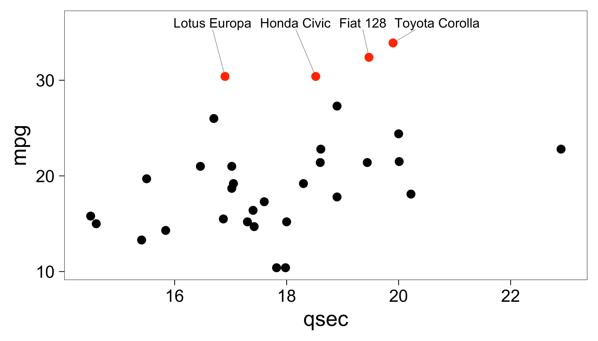

### Align labels on the left or right edge

Set `direction` to “y” and try `hjust` 0.5, 0, and 1:

``` r
set.seed(42)

p <- ggplot(mtcars, aes(y = wt, x = 1, label = rownames(mtcars))) +
  geom_point(color = "red") +
  ylim(1, 5.5) +
  theme(
    axis.line.x  = element_blank(),
    axis.ticks.x = element_blank(),
    axis.text.x  = element_blank(),
    axis.title.x = element_blank()
  )

p1 <- p +
  xlim(1, 1.375) +
  geom_text_repel(
    force        = 0.5,
    nudge_x      = 0.15,
    direction    = "y",
    hjust        = 0,
    segment.size = 0.2
  ) +
  ggtitle("hjust = 0")

p2 <- p + 
  xlim(1, 1.375) +
  geom_text_repel(
    force        = 0.5,
    nudge_x      = 0.2,
    direction    = "y",
    hjust        = 0.5,
    segment.size = 0.2
  ) +
  ggtitle("hjust = 0.5 (default)")

p3 <- p +
  xlim(0.25, 1) +
  scale_y_continuous(position = "right") +
  geom_text_repel(
    force        = 0.5,
    nudge_x      = -0.25,
    direction    = "y",
    hjust        = 1,
    segment.size = 0.2
  ) +
  ggtitle("hjust = 1")

gridExtra::grid.arrange(p1, p2, p3, ncol = 3)
```

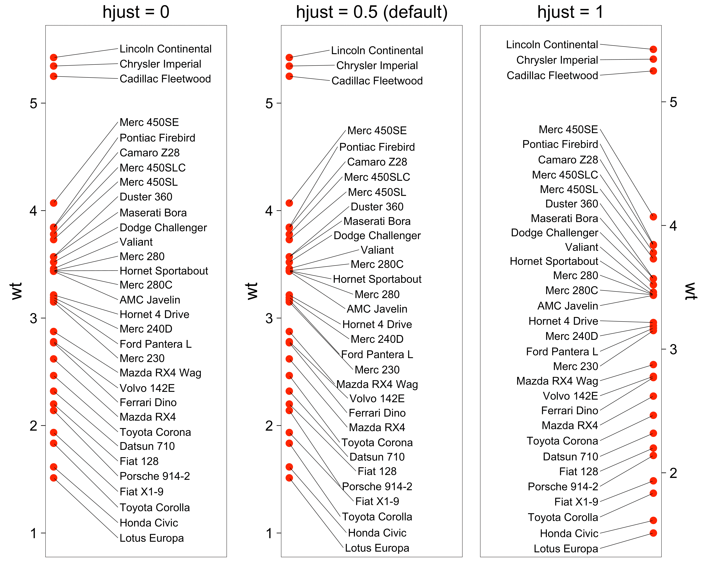

Align text horizontally with `nudge_x` and `hjust`, and allow the labels
to move vertically with `direction = "y"`:

``` r
set.seed(42)

dat <- subset(mtcars, wt > 2.75 & wt < 3.45)
dat$car <- rownames(dat)

ggplot(dat, aes(wt, mpg, label = car)) +
  geom_text_repel(
    data          = subset(dat, wt > 3),
    nudge_x       = 3.5 - subset(dat, wt > 3)$wt,
    segment.size  = 0.2,
    segment.color = "grey50",
    direction     = "y",
    hjust         = 0
  ) +
  geom_text_repel(
    data          = subset(dat, wt < 3),
    nudge_x       = 2.7 - subset(dat, wt < 3)$wt,
    segment.size  = 0.2,
    segment.color = "grey50",
    direction     = "y",
    hjust         = 1
  ) +
  scale_x_continuous(
    breaks = c(2.5, 2.75, 3, 3.25, 3.5),
    limits = c(2.4, 3.8)
  ) +
  geom_point(color = "red")
```

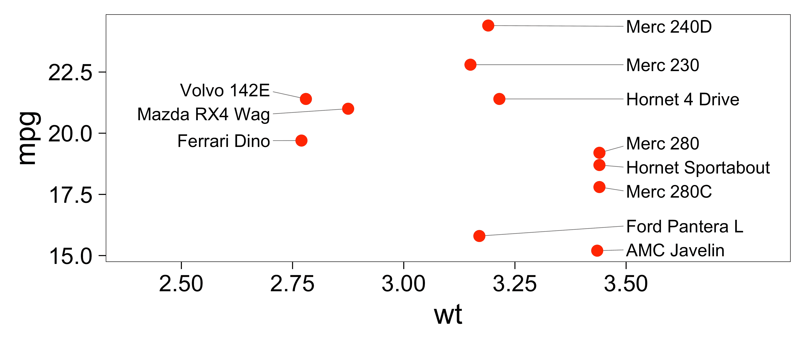

### Using ggrepel with stat_summary()

We can use
[`stat_summary()`](https://ggplot2.tidyverse.org/reference/stat_summary.html)
with `geom = "text_repel"`.

**Note:** When we use
[`ggplot2::stat_summary()`](https://ggplot2.tidyverse.org/reference/stat_summary.html)
with ggrepel, we should prefer
[`position_nudge_repel()`](https://ggrepel.slowkow.com/reference/position_nudge_repel.md)
instead of
[`ggplot2::position_nudge()`](https://ggplot2.tidyverse.org/reference/position_nudge.html).

The
[`position_nudge_repel()`](https://ggrepel.slowkow.com/reference/position_nudge_repel.md)
function nudges the text label’s position, but it also remembers the
original position of the data point.

``` r
p <- ggplot(mtcars, aes(factor(cyl), mpg)) +
  stat_summary(
    fill = "gray90",
    colour = "black", 
    fun = "mean",
    geom = "col"
  )

p1 <- p + stat_summary(
    aes(label = round(after_stat(y))), 
    fun = "mean",
    geom = "text_repel",
    min.segment.length = 0, # always draw segments
    position = position_nudge(y = -2)
  ) +
  labs(title = "position_nudge()")

p2 <- p + stat_summary(
    aes(label = round(after_stat(y))), 
    fun = "mean",
    geom = "text_repel",
    min.segment.length = 0, # always draw segments
    position = position_nudge_repel(y = -2)
  ) +
  labs(title = "position_nudge_repel()")

gridExtra::grid.arrange(p1, p2, ncol = 2)
```

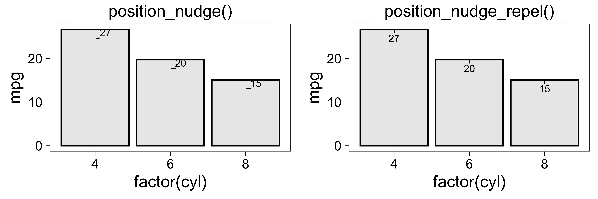

### Justify multiple lines of text with hjust

The `hjust` option should behave mostly the same way it does with
[`ggplot2::geom_text()`](https://ggplot2.tidyverse.org/reference/geom_text.html).

``` r
p <- ggplot() +
  coord_cartesian(xlim=c(0,1), ylim=c(0,1)) +
  theme_void()

labelInfo <- data.frame(
  x = c(0.45, 0.55),
  y = c(0.5, 0.5),
  g = c(
    "I'd like very much to be\nright justified.",
    "And I'd like to be\nleft justified."
  )
)

p + geom_text_repel(
  data          = labelInfo,
  mapping       = aes(x, y, label = g),
  size          = 5,
  hjust         = c(1, 0),
  nudge_x       = c(-0.05, 0.05),
  arrow         = arrow(length = unit(2, "mm"), ends = "last", type = "closed")
)
```

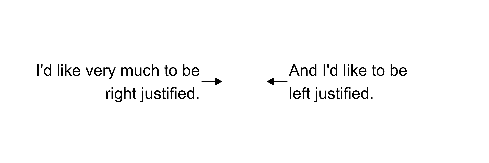

``` r
p + geom_label_repel(
  data          = labelInfo,
  mapping       = aes(x, y, label = g),
  size          = 5,
  hjust         = c(1, 0),
  nudge_x       = c(-0.05, 0.05),
  arrow         = arrow(length = unit(2, "mm"), ends = "last", type = "closed")
)
```

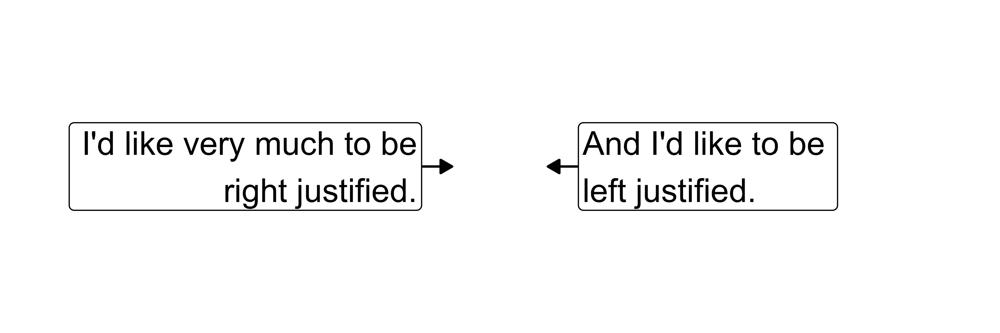

### marquee: Markdown with rich text styles and images

ggrepel now works with the [marquee](https://github.com/r-lib/marquee/)
package!

See the [marquee documentation](https://marquee.r-lib.org/) for more
information about how to control the styles.

We can use the function
[`geom_marquee_repel()`](https://ggrepel.slowkow.com/reference/geom_text_repel.md)
to plot rich text and images with automatic positioning, as shown in
this example below:

``` r
logo <- "https://cran.r-project.org/Rlogo.svg"

# Note: width values are in "npc" units (proportion of panel width).
# Use values between 0 and 1 (e.g., 0.3 = 30% of panel width).
df <- data.frame(
  x = c(0, 4.9, 5, 5.1, 10),
  y = c(0, 4.9, 5, 5.1, 10),
  labels = c(
    "Some {.blue *italic blue*} text",
    "Other {.red **bold red**} text",
    "More {.purple ~strikethrough~} text",
    "# Title\nBody text",
    paste0("")
  ),
  widths = c(0.3, 0.3, 0.3, 0.3, 0.3) # npc units, so 0.3 = 30% of panel width
)

# In this knitr chunk, we are using dev="ragg_png" like so:
# {r marquee, echo=TRUE, fig.width=6, fig.height=5, dev="ragg_png"}
ggplot(df, aes(x, y, label = labels, width = widths)) +
  geom_marquee_repel(
    box.padding = unit(5, "mm"), seed = 1
  ) +
  labs(title = 'dev="ragg_png"')
```

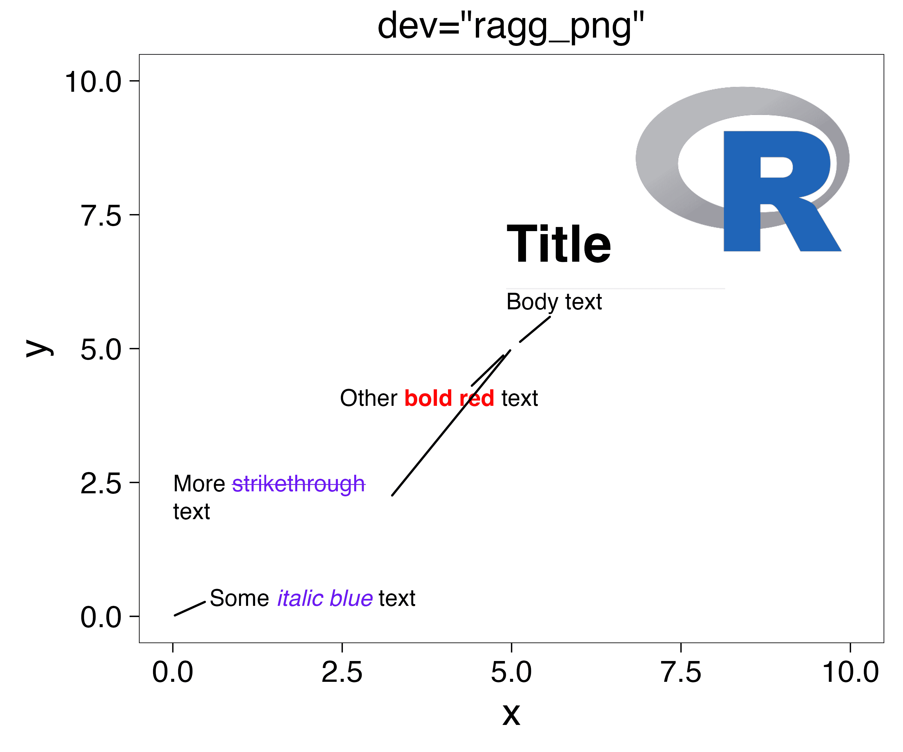

**Note:** When using
[`geom_marquee_repel()`](https://ggrepel.slowkow.com/reference/geom_text_repel.md),
you may want to use
**[ragg](https://ragg.r-lib.org/articles/ragg_quality.html)** instead of
the default renderer. This can improve the display of your plot.

If we use
[`geom_marquee_repel()`](https://ggrepel.slowkow.com/reference/geom_text_repel.md)
with `dev="png"` instead of `dev="ragg_png"`, then the result is more
pixelated:

``` r
# In this knitr chunk, we are using dev="png" like so:
# {r marquee-pixelated, echo=TRUE, fig.width=6, fig.height=5, dev="png"}
ggplot(df, aes(x, y, label = labels, width = widths)) +
  geom_marquee_repel(
    box.padding = unit(5, "mm"), seed = 1
  ) +
  labs(title = 'dev="png"')
```

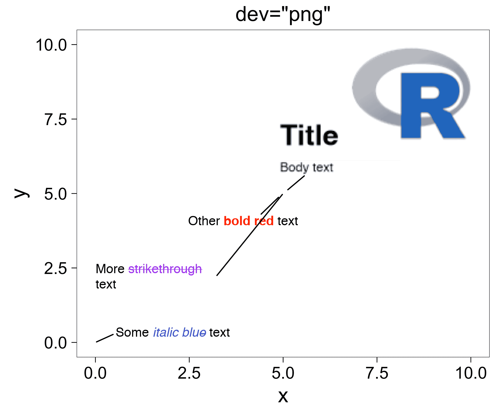

To learn more, see the
[ragg](https://ragg.r-lib.org/articles/ragg_quality.html) documentation
and read about the `device` argument for the
[`ggplot2::ggsave()`](https://ggplot2.tidyverse.org/reference/ggsave.html)
function.

### Repel axis labels with element_text_repel()

Use
[`element_text_repel()`](https://ggrepel.slowkow.com/reference/element_text_repel.md)
as a theme element to repel crowded axis labels. This is especially
useful when you have many categories on a categorical axis.

``` r
# A plot with many overlapping y-axis labels
p <- ggplot(mtcars, aes(mpg, rownames(mtcars))) +
  geom_col(fill = "steelblue")

# Expand the y-axis limits to make room for repelled labels
p + coord_cartesian(ylim = c(-32, 64)) +
  theme(axis.text.y.left = element_text_repel(margin = margin(r = 20)))
```

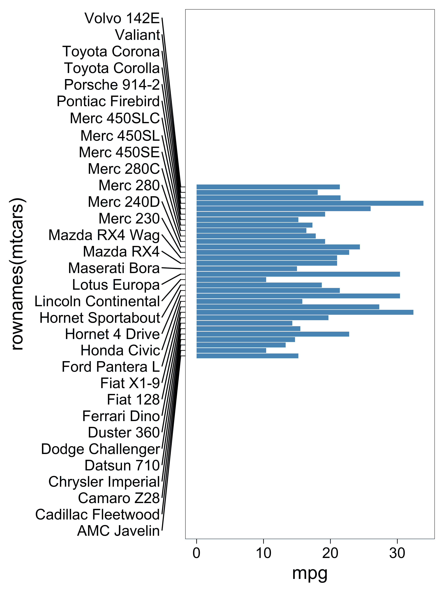

You can customize the connecting segments with curvature and color
options:

``` r
p + coord_cartesian(ylim = c(-32, 64)) +
  theme(
    axis.text.y.left = element_text_repel(
      margin = margin(r = 20),
      segment.curvature = -0.1,
      segment.inflect = TRUE,
      segment.colour = "red"
    ),
    axis.ticks.y.left = element_line(colour = "red")
  )
```

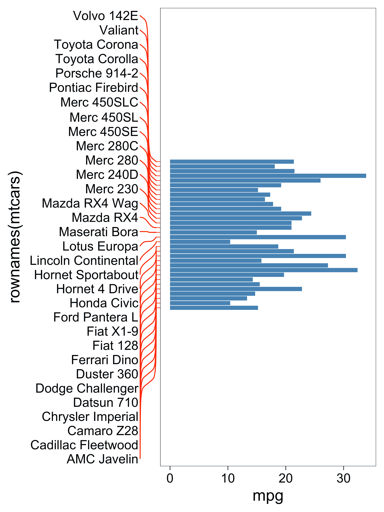

For secondary axes (top and right), use the `position` argument:

``` r
x <- c(0, 4.9, 5, 5.1, 10)
labels <- c("Lorem ipsum", "dolor amet", "consectetur", "adipiscing", "elit")

ggplot(mapping = aes(x, x, colour = x)) +
  geom_point(size = 3) +
  scale_x_continuous(breaks = x, labels = labels) +
  scale_y_continuous(breaks = x, labels = labels) +
  scale_colour_viridis_c(breaks = x, labels = labels) +
  guides(x.sec = "axis", y.sec = "axis") +
  theme(
    axis.text.x.bottom = element_text_repel(angle = 90, margin = margin(t = 70)),
    axis.text.y.left   = element_text_repel(margin = margin(r = 10)),
    axis.text.x.top    = element_text_repel(angle = 90,margin = margin(b = 70), position = "top"),
    axis.text.y.right  = element_text_repel(margin = margin(l = 10), position = "right"),
    legend.text        = element_text_repel(margin = margin(l = 10), position = "right")
  )
```

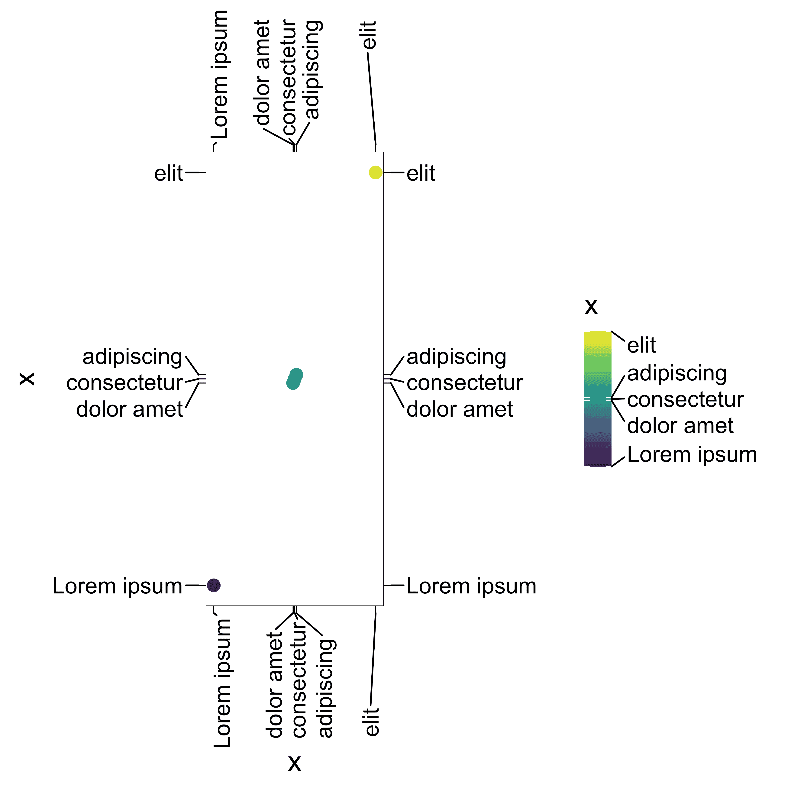

### Label jittered points

``` r
mtcars$label <- rownames(mtcars)
mtcars$label[mtcars$cyl != 6] <- ""

# Available since ggplot2 2.2.1
pos <- position_jitter(width = 0.3, seed = 2)

ggplot(mtcars, aes(factor(cyl), mpg, color = label != "", label = label)) +
  geom_point(position = pos) +
  geom_text_repel(position = pos) +
  theme(legend.position = "none") +
  labs(title = "position_jitter()")
```

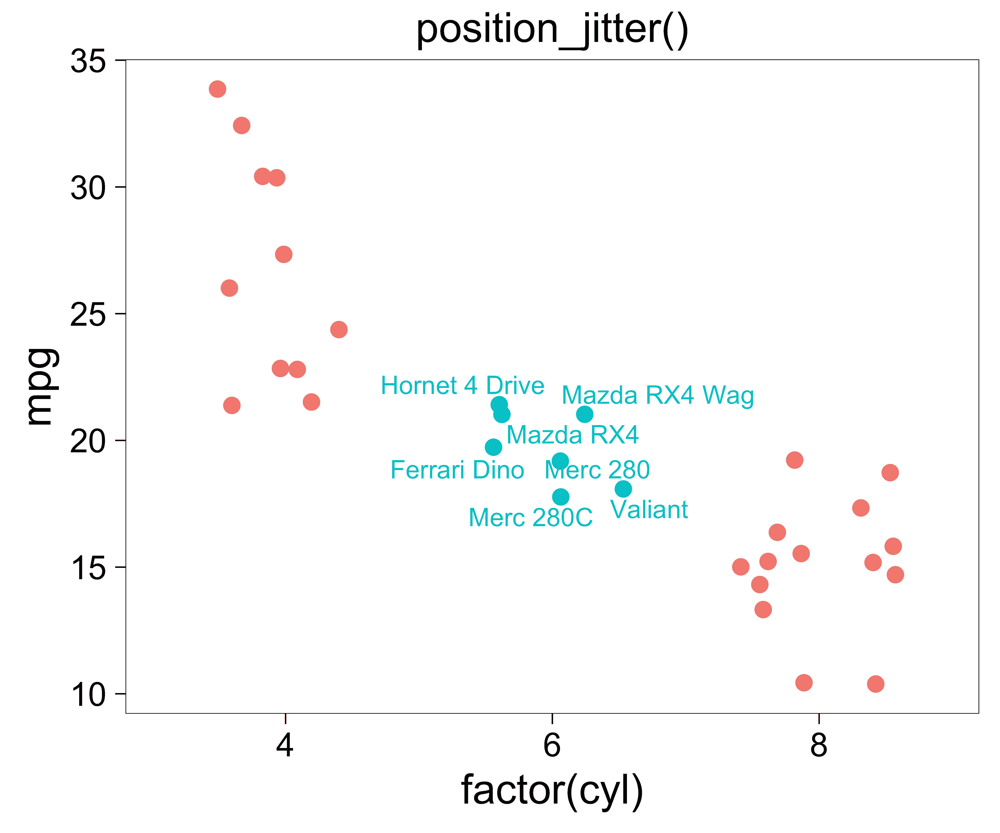

You can also use other position functions, like
[`position_quasirandom()`](https://rdrr.io/pkg/ggbeeswarm/man/position_quasirandom.html)
from the [ggbeeswarm](https://github.com/eclarke/ggbeeswarm) package by
[Erik Clarke](https://github.com/eclarke):

``` r
mtcars$label <- rownames(mtcars)
mtcars$label[mtcars$cyl != 6] <- ""

library(ggbeeswarm)
pos <- position_quasirandom()

ggplot(mtcars, aes(factor(cyl), mpg, color = label != "", label = label)) +
  geom_point(position = pos) +
  geom_text_repel(position = pos) +
  theme(legend.position = "none") +
  labs(title = "position_quasirandom()")
```

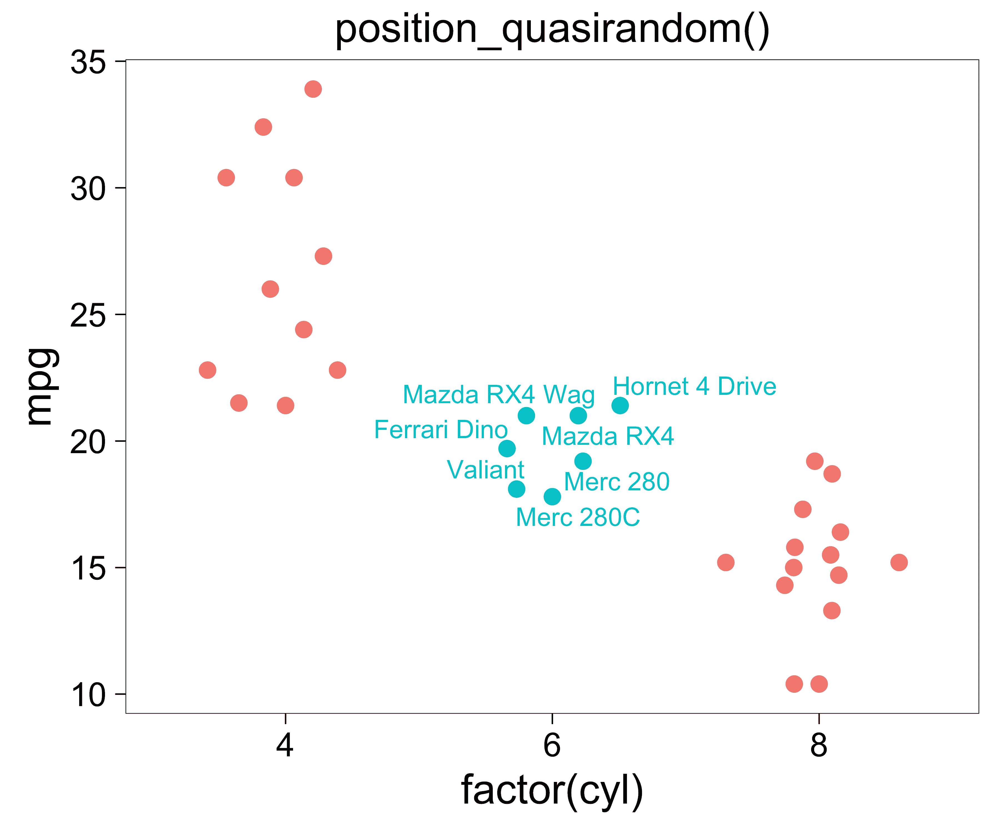

### Nudge labels in different directions with ggpp

[Pedro Aphalo](https://github.com/aphalo) created a great extension
package for ggplot2 called
[ggpp](https://docs.r4photobiology.info/ggpp/) that provides useful
functions such as
[`position_nudge_center()`](https://docs.r4photobiology.info/ggpp/reference/position_nudge_center.html),
which we demonstrate below:

``` r
library(ggpp)
library(patchwork)

## Example data frame where each species' principal components have been computed.
df <- data.frame(
  Species = paste("Species", 1:5),
  PC1     = c(-4, -3.5, 1, 2, 3),
  PC2     = c(-1, -1, 0, -0.5, 0.7)
) 

p <- ggplot(df, aes(x = PC1, y = PC2, label = Species)) +
  geom_segment(aes(x = 0, y = 0, xend = PC1, yend = PC2), 
  arrow = arrow(length = unit(0.1, "inches"))) +
  xlim(-5, 5) +
  ylim(-2, 2) +
  geom_hline(aes(yintercept = 0), linewidth = 0.2) +
  geom_vline(aes(xintercept = 0), linewidth = 0.2)

p1 <- p + geom_text_repel()
p2 <- p + geom_text_repel(position = position_nudge_center(0.2, 0.1, 0, 0))
p1 + (p2 + labs(title = "position_nudge_center()"))
```

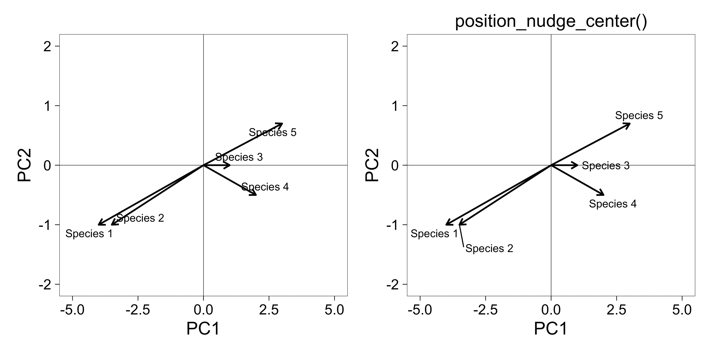

### Label `sf` objects

Currently if you use
[`geom_text_repel()`](https://ggrepel.slowkow.com/reference/geom_text_repel.md)
or
[`geom_label_repel()`](https://ggrepel.slowkow.com/reference/geom_text_repel.md)
with a
[`ggplot2::geom_sf`](https://ggplot2.tidyverse.org/reference/ggsf.html)
plot, you will probably get an error like

`Error: geom_label_repel requires the following missing aesthetics: x and y`

There’s a workaround to this which will enable the `ggrepel` functions
to work with spatial `sf` plots like this - you just need to include:

`stat = "sf_coordinates"`

in the `geom_text|label_repel()` call.

``` r
# thanks to Hiroaki Yutani 
# https://github.com/slowkow/ggrepel/issues/111#issuecomment-416853013

library(ggplot2)
library(sf)

nc <- sf::st_read(system.file("shape/nc.shp", package="sf"), quiet = TRUE)

ggplot(nc) +
  geom_sf() +
  ggrepel::geom_label_repel(
    data = head(nc),
    aes(label = NAME, geometry = geometry),
    stat = "sf_coordinates",
    min.segment.length = 0
  )
```

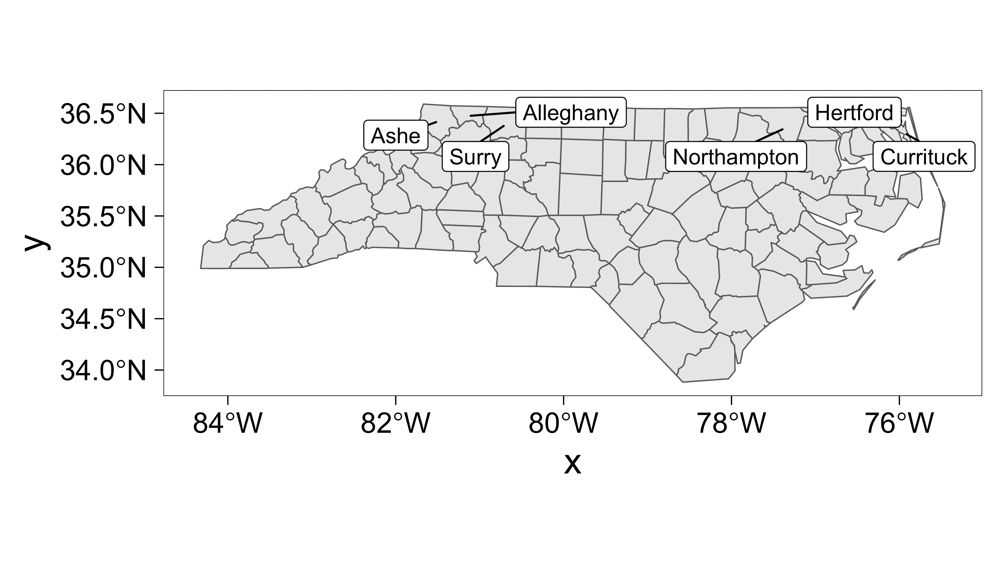

Thanks to [Hiroaki
Yutani](https://github.com/slowkow/ggrepel/issues/111#issuecomment-416853013)
for the solution.

### Shadows (or glow) under text labels

We can place shadows (or glow) underneath each text label to enhance the
readability of the text. This might be useful when text labels are
placed on top of other plot elements. This feature uses the same code as
the [shadowtext](https://github.com/GuangchuangYu/shadowtext) package by
[Guangchuang Yu](https://github.com/GuangchuangYu).

``` r
set.seed(42)
ggplot(dat, aes(wt, mpg, label = car)) +
  geom_point(color = "red") +
  geom_text_repel(
    color = "white",     # text color
    bg.color = "grey30", # shadow color
    bg.r = 0.15          # shadow radius
  )
```

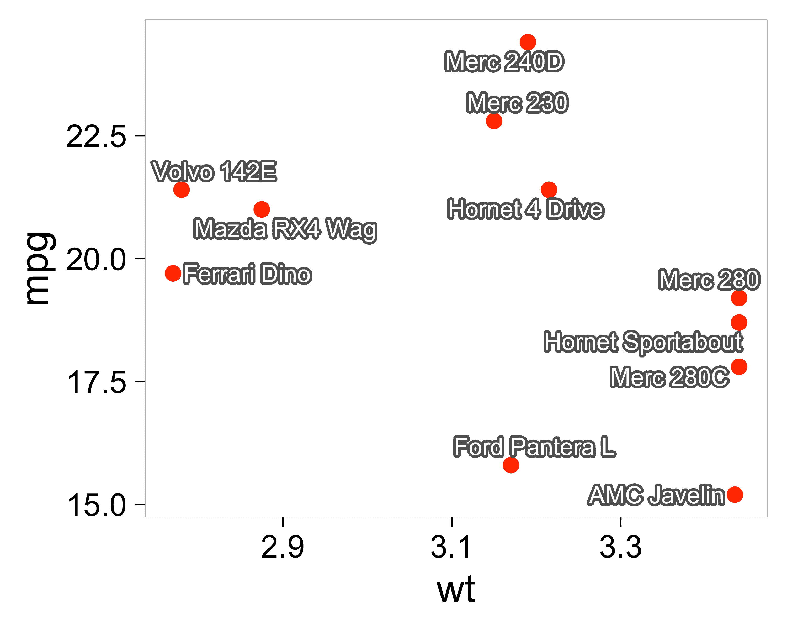

### Verbose timing information

By default, ggrepel will respect the global `verbose` option, so please
check `getOption("verbose")` to see if this is set to TRUE or FALSE in
your environment. We can set the global option with
`options(verbose = TRUE)` or `options(verbose = FALSE)`.

We can override the global value by using
`geom_text_repel(verbose = TRUE)` or `geom_text_repel(verbose = FALSE)`.

Use `verbose = TRUE` to see:

- how many iterations of the physical simulation were completed
- how much time has elapsed, in seconds
- how many overlaps remain unresolved in the final figure

``` r
p <- ggplot(mtcars,
  aes(wt, mpg, label = rownames(mtcars), colour = factor(cyl))) +
  geom_point()

p + geom_text_repel(
  verbose = TRUE,
  seed = 123,
  max.time = 0.1,
  max.iter = Inf,
  size = 3
)
```

    ## ggrepel: 0.100000s elapsed for 1180 iterations, 46 overlaps. Consider increasing 'max.time'.

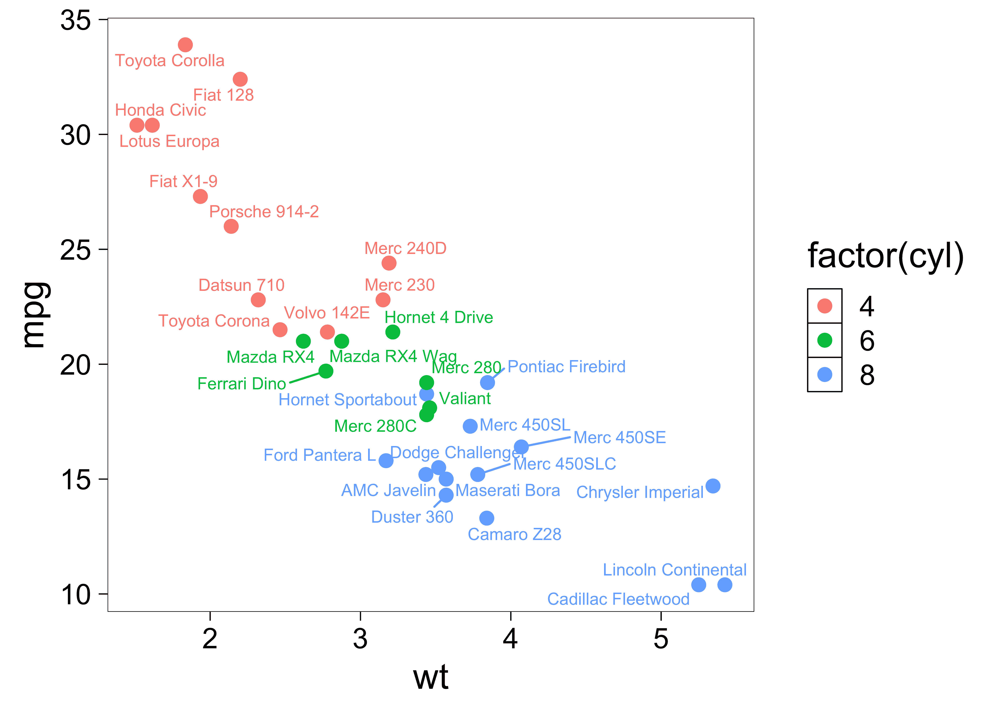

### Word cloud

**Note:** The **[ggwordcloud](https://github.com/lepennec/ggwordcloud)**
package by [Erwan Le Pennec](https://github.com/lepennec) creates much
better word clouds than ggrepel.

The `force` option controls the strength of repulsion.

The `force_pull` option controls the strength of the spring that pulls
the text label toward its data point.

To make a word cloud, we can assign all of the text labels the same data
point at the origin (0, 0) and set `force_pull = 0` to disable the
springs.

``` r
set.seed(42)
ggplot(mtcars) +
  geom_text_repel(
    aes(
      label  = rownames(mtcars),
      size   = mpg > 15,
      colour = factor(cyl),
      x      = 0,
      y      = 0
    ),
    force_pull    = 0, # do not pull text toward the point at (0,0)
    max.time      = 0.5,
    max.iter      = 1e5,
    max.overlaps  = Inf,
    segment.color = NA,
    point.padding = NA
  ) +
  theme_void() +
  theme(strip.text = element_text(size = 16)) +
  facet_wrap(~ factor(cyl)) +
  scale_color_discrete(name = "Cylinders") +
  scale_size_manual(values = c(2, 3)) +
  theme(
    strip.text   = element_blank(),
    panel.border = element_rect(size = 0.2, fill = NA)
  )
```

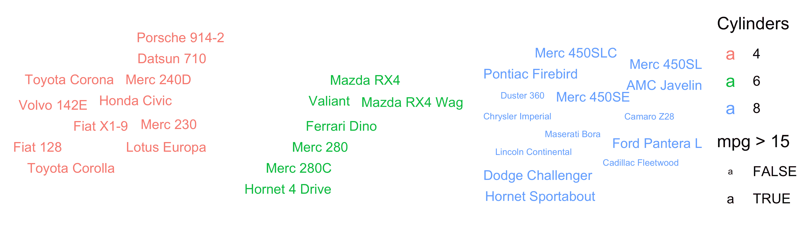

### Polar coordinates

``` r
set.seed(42)

mtcars$label <- rownames(mtcars)
mtcars$label[mtcars$mpg < 25] <- ""

ggplot(mtcars, aes(x = wt, y = mpg, color = factor(cyl), label = label)) +
  coord_polar(theta = "x") +
  geom_point(size = 2) +
  scale_color_discrete(name = "cyl") +
  geom_text_repel(show.legend = FALSE) + # Don't display "a" in the legend.
  theme_bw(base_size = 18)
```

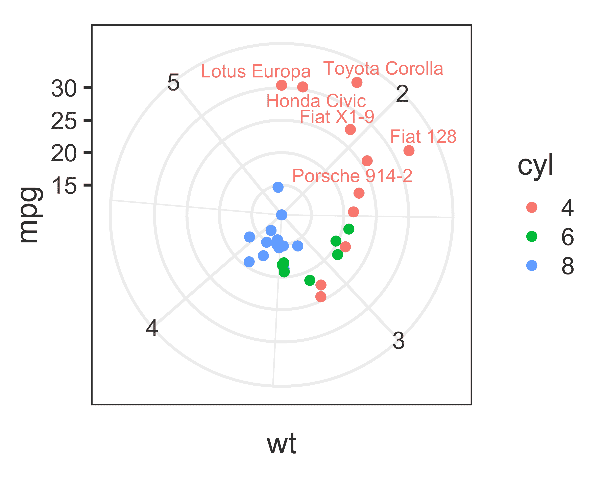

### Modified coordinates

ggrepel works with modified x and y coordinates:

``` r
p <- ggplot(mtcars, aes(wt, mpg, label = rownames(mtcars))) +
  geom_text_repel() +
  geom_point(color = 'red')
```

``` r
# Swap the x and y coordinates
p + coord_flip()
```

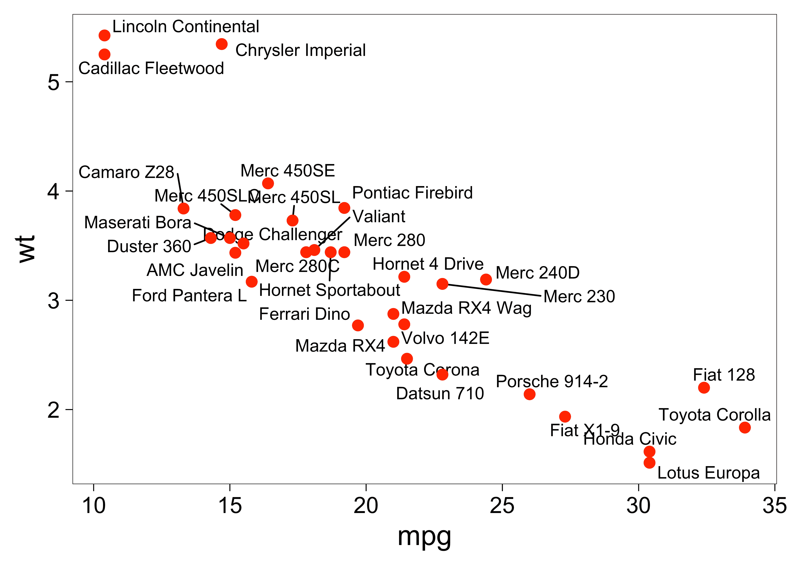

``` r
# Limit the x-axis to values <= 3
p + scale_x_continuous(limits = c(NA, 3))
```

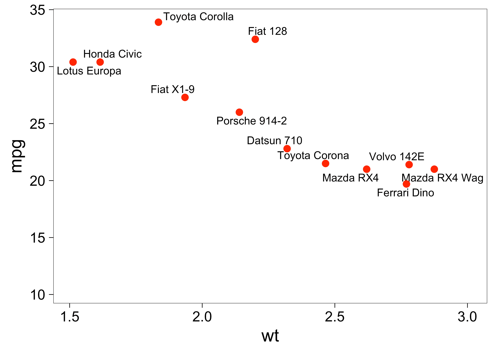

``` r
# Transform the y-axis with a pseudo log transformation
p + coord_trans(y = scales::pseudo_log_trans(base = 2, sigma = 0.1))
```

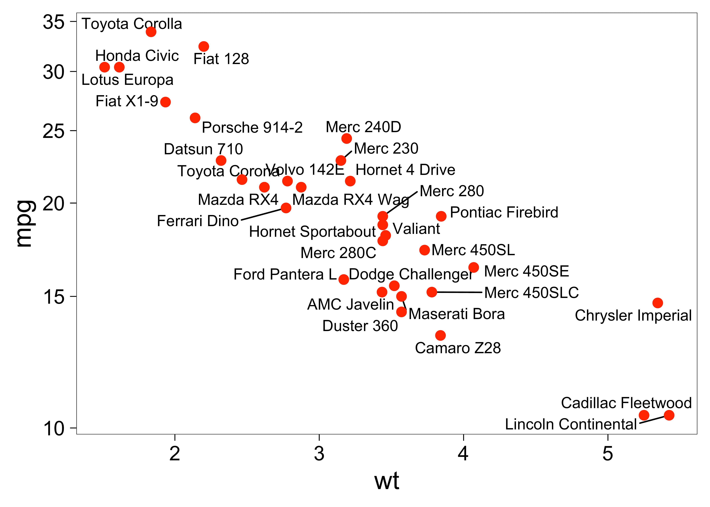

### Unicode characters (Japanese)

``` r
library(ggrepel)

set.seed(42)
dat <- data.frame(
  x = runif(32),
  y = runif(32),
  label = strsplit(
    x = "原文篭毛與美篭母乳布久思毛與美夫君志持此岳尓菜採須兒家吉閑名思毛",
    split = ""
  )[[1]]
)

# Make sure to choose a font that is installed on your system.
my_font <- "HiraginoSans-W0"

ggplot(dat, aes(x, y, label = label)) +
  geom_point(size = 2, color = "red") +
  geom_text_repel(size = 8, family = my_font) +
  ggtitle("テスト") +
  theme_bw(base_size = 18, base_family = my_font)
```

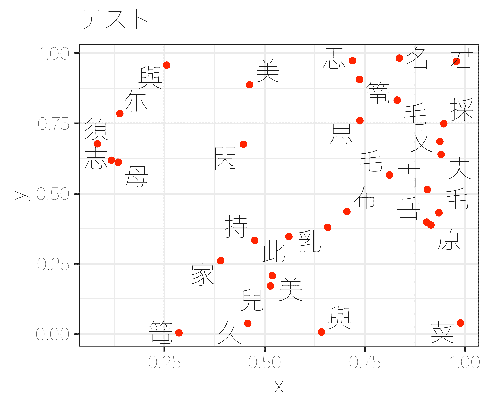

### Mathematical expressions

``` r
d <- data.frame(
  x    = c(1, 2, 2, 1.75, 1.25),
  y    = c(1, 3, 1, 2.65, 1.25),
  math = c(
    NA,
    "integral(f(x) * dx, a, b)",
    NA,
    "lim(f(x), x %->% 0)",
    NA
  )
)

ggplot(d, aes(x, y, label = math)) +
  geom_point() +
  geom_label_repel(
    parse       = TRUE, # Parse mathematical expressions.
    size        = 6,
    box.padding = 2
  )
```

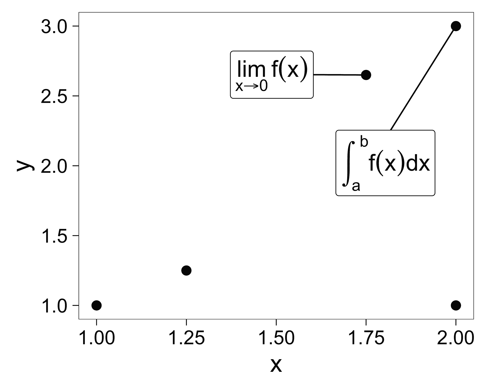

### Animation

``` r
# This chunk of code will take a minute or two to run.
library(ggrepel)
library(animation)

plot_frame <- function(n) {
  set.seed(42)
  p <- ggplot(mtcars, aes(wt, mpg, label = rownames(mtcars))) +
    geom_text_repel(
      size = 5, force = 1, max.iter = n
    ) +
    geom_point(color = "red") +
    # theme_minimal(base_size = 16) +
    labs(title = n)
  print(p)
}

xs <- ceiling(1.18^(1:52))
# xs <- ceiling(1.4^(1:26))
xs <- c(xs, rep(xs[length(xs)], 15))
# plot(xs)

saveGIF(
  lapply(xs, function(i) {
    plot_frame(i)
  }),
  interval   = 0.15,
  ani.width  = 800,
  ani.heigth = 600,
  movie.name = "animated.gif"
)
```

## Source code

View the [source code for this
vignette](https://github.com/slowkow/ggrepel/blob/master/vignettes/examples.Rmd)
on GitHub.

## R Session Info

``` r
sessionInfo()
```

    ## R version 4.5.2 (2025-10-31)
    ## Platform: aarch64-apple-darwin20
    ## Running under: macOS Sequoia 15.6.1
    ## 
    ## Matrix products: default
    ## BLAS:   /System/Library/Frameworks/Accelerate.framework/Versions/A/Frameworks/vecLib.framework/Versions/A/libBLAS.dylib 
    ## LAPACK: /Library/Frameworks/R.framework/Versions/4.5-arm64/Resources/lib/libRlapack.dylib;  LAPACK version 3.12.1
    ## 
    ## locale:
    ## [1] en_US.UTF-8/en_US.UTF-8/en_US.UTF-8/C/en_US.UTF-8/en_US.UTF-8
    ## 
    ## time zone: America/New_York
    ## tzcode source: internal
    ## 
    ## attached base packages:
    ## [1] stats     graphics  grDevices utils     datasets  methods   base     
    ## 
    ## other attached packages:
    ## [1] sf_1.0-23        patchwork_1.3.2  ggpp_0.5.9       ggbeeswarm_0.7.3
    ## [5] ggrepel_0.9.7    testthat_3.3.1   ggplot2_4.0.1    gridExtra_2.3   
    ## [9] knitr_1.51      
    ## 
    ## loaded via a namespace (and not attached):
    ##  [1] gtable_0.3.6       beeswarm_0.4.0     xfun_0.56          bslib_0.10.0      
    ##  [5] htmlwidgets_1.6.4  vctrs_0.7.1        tools_4.5.2        generics_0.1.4    
    ##  [9] tibble_3.3.1       proxy_0.4-27       pkgconfig_2.0.3    KernSmooth_2.23-26
    ## [13] RColorBrewer_1.1-3 S7_0.2.1           desc_1.4.3         lifecycle_1.0.5   
    ## [17] compiler_4.5.2     farver_2.1.2       textshaping_1.0.4  brio_1.1.5        
    ## [21] codetools_0.2-20   vipor_0.4.7        htmltools_0.5.9    class_7.3-23      
    ## [25] sass_0.4.10        yaml_2.3.12        pillar_1.11.1      pkgdown_2.2.0     
    ## [29] jquerylib_0.1.4    MASS_7.3-65        classInt_0.4-11    cachem_1.1.0      
    ## [33] tidyselect_1.2.1   digest_0.6.39      stringi_1.8.7      dplyr_1.1.4       
    ## [37] labeling_0.4.3     rsvg_2.7.0         fastmap_1.2.0      grid_4.5.2        
    ## [41] marquee_1.2.1      cli_3.6.5          magrittr_2.0.4     dichromat_2.0-0.1 
    ## [45] e1071_1.7-16       withr_3.0.2        scales_1.4.0       lubridate_1.9.4   
    ## [49] timechange_0.3.0   rmarkdown_2.30     otel_0.2.0         ragg_1.5.0        
    ## [53] evaluate_1.0.5     viridisLite_0.4.2  rlang_1.1.7        Rcpp_1.1.1        
    ## [57] glue_1.8.0         polynom_1.4-1      DBI_1.2.3          jsonlite_2.0.0    
    ## [61] R6_2.6.1           systemfonts_1.3.1  fs_1.6.6           units_1.0-0
