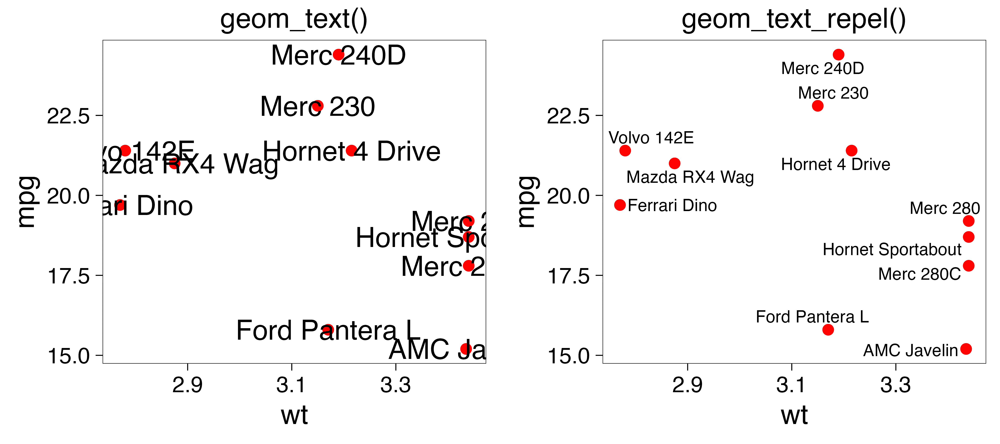

# Getting started with ggrepel

## Overview

ggrepel provides geoms for [ggplot2](https://ggplot2.tidyverse.org/) to
repel overlapping text labels:

- [`geom_text_repel()`](https://ggrepel.slowkow.com/reference/geom_text_repel.md)
- [`geom_label_repel()`](https://ggrepel.slowkow.com/reference/geom_text_repel.md)

Text labels repel away from each other, away from data points, and away
from edges of the plotting area (panel).

Let’s compare
[`geom_text()`](https://ggplot2.tidyverse.org/reference/geom_text.html)
and
[`geom_text_repel()`](https://ggrepel.slowkow.com/reference/geom_text_repel.md):

``` r
library(ggrepel)
set.seed(42)

dat <- subset(mtcars, wt > 2.75 & wt < 3.45)
dat$car <- rownames(dat)

p <- ggplot(dat, aes(wt, mpg, label = car)) +
  geom_point(color = "red")

p1 <- p + geom_text() + labs(title = "geom_text()")

p2 <- p + geom_text_repel() + labs(title = "geom_text_repel()")

gridExtra::grid.arrange(p1, p2, ncol = 2)
```



## Installation

ggrepel is available on
[CRAN](https://CRAN.R-project.org/package=ggrepel):

``` r
install.packages("ggrepel")
```

The [latest development version](https://github.com/slowkow/ggrepel) may
have new features, and you can get it from GitHub:

``` r
# Use the devtools package
# install.packages("devtools")
devtools::install_github("slowkow/ggrepel")
```

## Usage

See the [examples](https://ggrepel.slowkow.com/articles/examples.html)
page to learn more about how to use ggrepel in your project.
