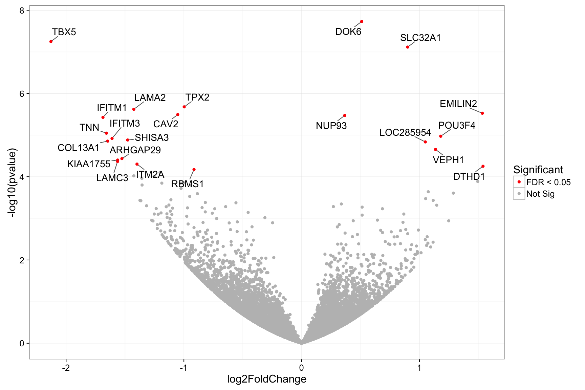
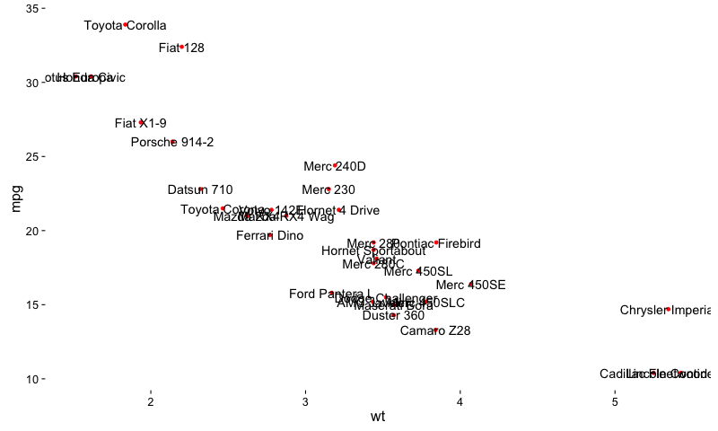

```{r setup, echo=FALSE, results='hide', warning=FALSE, error=FALSE, message=FALSE, cache=FALSE}
library(knitr)
opts_chunk$set(
  cache = TRUE,
  autodep = TRUE,
  echo = FALSE,
  warning = FALSE,
  error = FALSE,
  message = FALSE,
  out.width = 700,
  fig.width = 12,
  fig.height = 8,
  dpi = 84,
  cache.path = "cache/ggrepel/",
  fig.path = "figures/ggrepel/",
  concordance = TRUE
)
```

# ggrepel

## Motivation

Some text labels overlap each other in plots created with [geom_text]:

```{r geom_text, echo=TRUE, fig.width=9, fig.height=7}
library(ggplot2)
ggplot(mtcars) +
  geom_point(aes(wt, mpg), color = 'red') +
  geom_text(aes(wt, mpg, label = rownames(mtcars))) +
  theme_classic(base_size = 16)
```

## Algorithm

`ggrepel` implements functions to repel overlapping text labels away from
each other and away from the data points that they label. The algorithm
works as follows:

- For each box:
    - Move the box into the allowed plotting area.
    - If the bounding box overlaps other boxes:
        - Repel the overlapping boxes from each other.
    - If the bounding box overlaps data points:
        - Repel the box away from the data points.
- Repeat until all overlaps are resolved, up to a preset limit
  of iterations.

## Usage Examples

### geom_text_repel

We can repel the text labels away from each other by loading `ggrepel` and
using `geom_text_repel` instead:

```{r geom_text_repel, echo=TRUE, fig.width=9, fig.height=7}
library(ggrepel)
set.seed(42)
ggplot(mtcars) +
  geom_point(aes(wt, mpg), color = 'red') +
  geom_text_repel(aes(wt, mpg, label = rownames(mtcars))) +
  theme_classic(base_size = 16)
```

### geom_label_repel

`geom_label_repel` is based on [geom_label].

```{r geom_label_repel, echo=TRUE}
set.seed(42)
ggplot(mtcars) +
  geom_point(aes(wt, mpg), size = 5, color = 'grey') +
  geom_label_repel(
    aes(wt, mpg, fill = factor(cyl), label = rownames(mtcars)),
    fontface = 'bold', color = 'white',
    box.padding = unit(0.35, "lines"),
    point.padding = unit(0.5, "lines"),
    segment.color = 'grey50'
  ) +
  theme_classic(base_size = 16)
```

### Options

All options available for [geom_text] such as `size`, `angle`, `family`,
`fontface` are also available for `geom_text_repel`.

However, the following parameters are not supported:

- `hjust`
- `vjust`
- `position`
- `check_overlap`

`ggrepel` provides additional parameters for `geom_text_repel` and `geom_label_repel`:

- `segment.color` is the line segment color
- `segment.size` is the line segment thickness
- `segment.alpha` is the line segment transparency
- `box.padding` is the padding surrounding the text bounding box
- `point.padding` is the padding around the labeled point
- `arrow` is the specification for arrow heads created by `grid::arrow`
- `force` is the force of repulsion between overlapping text labels
- `max.iter` is the maximum number of iterations to attempt to resolve overlaps
- `nudge_x` is how much to shift the starting position of the text label along
  the x axis
- `nudge_y` is how much to shift the starting position of the text label along
  the y axis
  
Here is an example that uses all of these options:

```{r geom_text_repel_options, echo=TRUE, fig.width=9, fig.height=7}
set.seed(42)
ggplot(mtcars) +
  geom_point(aes(wt, mpg, color = factor(cyl)), size = 3) +
  geom_text_repel(
    aes(
      wt, mpg,
      color = factor(cyl),
      label = rownames(mtcars),
      # Cars with 4 cylinders are rotated 90 degrees.
      angle = ifelse(mtcars$cyl == 4, 90, 0)
    ),
    size = 4,
    family = 'Times',
    fontface = 'bold',
    # Add extra padding around each text label.
    box.padding = unit(0.5, 'lines'),
    # Add extra padding around each data point.
    point.padding = unit(1.6, 'lines'),
    # Color of the line segments.
    segment.color = '#cccccc',
    # Width of the line segments.
    segment.size = 0.5,
    # Draw an arrow from the label to the data point.
    arrow = arrow(length = unit(0.01, 'npc')),
    # Strength of the repulsion force.
    force = 1,
    # Maximum iterations of the naive repulsion algorithm O(n^2).
    max.iter = 3e3,
    # Cars with 6 cylinders are nudged up and to the right.
    nudge_x = ifelse(mtcars$cyl == 6, 2, 0),
    nudge_y = ifelse(mtcars$cyl == 6, 9, 0)
  ) +
  scale_color_discrete(name = 'cyl') +
  scale_x_continuous(expand = c(0.5, 0)) +
  scale_y_continuous(expand = c(0.25, 0)) +
  theme_classic(base_size = 16)
```

### Repel labels and ignore data points

Set `point.padding = NA` to exclude all data points from repulsion calculations.

```{r geom_text_repel_point_padding_na, echo=TRUE, fig.width=9, fig.height=7}
set.seed(42)

mtcars$label <- rownames(mtcars)

ggplot(mtcars, aes(wt, mpg, label = label)) +
  geom_point(color = "red") +
  geom_text_repel(point.padding = NA) +
  theme_bw(base_size = 16)
```

### Hide some of the labels

Set some labels to the empty string `""` to hide them. All data points will
still repel the remaining labels.

```{r geom_text_repel_empty_string, echo=TRUE, fig.width=9, fig.height=7}
set.seed(42)

mtcars$label <- rownames(mtcars)
mtcars$label[1:15] <- ""

ggplot(mtcars, aes(wt, mpg)) +
  geom_point(aes(color = factor(cyl)), size = 2) +
  geom_text_repel(
    aes(
      color = factor(cyl),
      size = hp,
      label = label
    ),
    point.padding = unit(0.25, "lines"),
    box.padding = unit(0.25, "lines"),
    nudge_y = 0.1
  ) +
  theme_bw(base_size = 16)
```

### Line plot

```{r line_plot, echo=TRUE, fig.width=9, fig.height=7}
set.seed(42)
ggplot(Orange, aes(age, circumference, color = Tree)) +
  geom_line() +
  coord_cartesian(xlim = c(min(Orange$age), max(Orange$age) + 90)) +
  geom_text_repel(
    data = subset(Orange, age == max(age)),
    aes(label = paste("Tree", Tree)),
    size = 6,
    nudge_x = 45,
    segment.color = NA
  ) +
  theme_classic(base_size = 16) +
  theme(legend.position = "none") +
  labs(title = "Orange Trees", x = "Age (days)", y = "Circumference (mm)")
```

### Volcano plot

```{r volcano, echo=TRUE, eval=FALSE}
set.seed(42)

# Read Stephen Turner's data
genes <- read.table("genes.txt.bz2", header = TRUE)
genes$Significant <- ifelse(genes$padj < 0.05, "FDR < 0.05", "Not Sig")

ggplot(genes, aes(x = log2FoldChange, y = -log10(pvalue))) +
  geom_point(aes(color = Significant)) +
  scale_color_manual(values = c("red", "grey")) +
  theme_bw(base_size = 16) +
  geom_text_repel(
    data = subset(genes, padj < 0.05),
    aes(label = Gene),
    size = 5,
    box.padding = unit(0.35, "lines"),
    point.padding = unit(0.3, "lines")
  )
ggsave("figures/ggrepel/volcano-1.png", width = 12, height = 8, dpi = 84)
```



### Polar coordinates

```{r geom_text_repel_polar, echo=TRUE, fig.width=9, fig.height=7}
set.seed(42)

mtcars$label <- rownames(mtcars)
mtcars$label[mtcars$mpg < 25] <- ""
ggplot(mtcars, aes(x = wt, y = mpg, label = label)) +
  coord_polar(theta = "x") +
  geom_point(aes(color = factor(cyl)), size = 2) +
  geom_text_repel(
    aes(
      color = factor(cyl)
    ),
    point.padding = unit(0.25, "lines"),
    box.padding = unit(0.25, "lines"),
    nudge_y = 0.1
  ) +
  theme_bw(base_size = 16)
```

### Animation

```{r animated, echo=TRUE, eval=FALSE}
# This chunk of code will take a minute or two to run.
library(ggrepel)
library(animation)

plot_frame <- function(n) {
  set.seed(42)
  p <- ggplot(mtcars) +
    geom_point(aes(wt, mpg), color = 'red') +
    geom_text_repel(
      aes(wt, mpg, label = rownames(mtcars)),
      size = 5, force = 3, max.iter = n
    ) +
    theme_classic(base_size = 16)
  print(p)
}

saveGIF(
  lapply(ceiling(1.75^(1:12)), function(i) {
    plot_frame(i)
  }),
  interval = 0.20,
  ani.width = 800,
  ani.heigth = 600,
  movie.name = 'animated.gif'
)
```



## R Session Info

```{r session_info, echo=TRUE}
sessionInfo()
```

[geom_text]: http://docs.ggplot2.org/current/geom_text.html
[geom_label]: http://docs.ggplot2.org/current/geom_text.html
